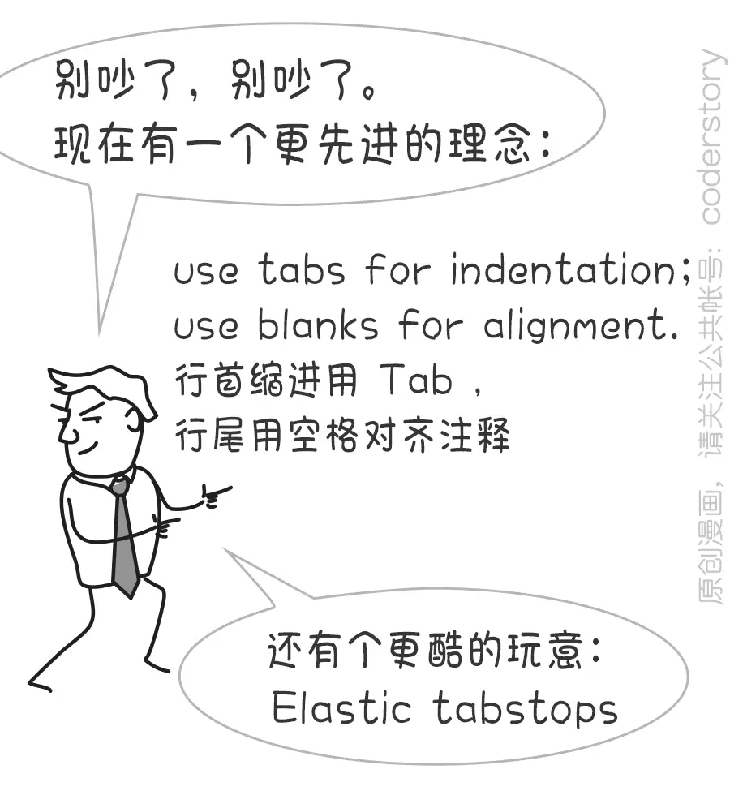

# 如何制定和实施ES6+
  代码风格和质量标准
  ________________________________
  （观赏本 slide 请使用 Chrome 45+ 等支持 ES6、Fetch API 等新特性的浏览器）

by Hax

## Introduction of
   my company
	 and myself

百姓网
www.baixing.com

分类信息,
58赶集合并后自动排名上升一位,
将于年底上市新三板

Send your resume to
简历请投
heshijun@baixing.com

github: @hax
zhihu: 贺师俊
weibo: @johnhax

今年做了很多演讲，比如,
JavaScript: The World's Best
Programming Language

争议性

回避,
嘲笑

值得讨论

Coding Style

## 重要吗？

Significant?

OR

Trivial?

Trivial
其实并没有那么重要

代码逻辑,
模块划分,
架构设计,
……

命名

## 既然并不是最重要
   那么为什么要有
   Coding Style？

积沙成塔
集腋成裘

Programming-in-the-large

个人作坊 => 团队协作,
一次性项目 => 长期演化

一个人随便 => 一群人痛苦,
一夜的潇洒 => 一生的痛苦

一屋不扫
何以扫天下

clean code
意识和习惯

解决 trivial 问题
是为了更好的集中精力解决
significant 问题

code review
不要浪费时间
在琐碎的事情

制定 + 实施

制定的反例：分号

实施的反例：对齐

知行
合一

JavaScript,
Good part VS Bad part,
ES5 => ES2015

## 工具
   可实施性的保障

- jslint
- jshint
- jsdc
- eslint

[ESLint](http://eslint.org/index.html),
by Nicholas C. Zakas,
可插拔架构,
高度可配置,
预置大量规则,
可共享复用

可插拔架构
[airbnb代码风格的ES6部分](https://github.com/airbnb/javascript/blob/master/packages/eslint-config-airbnb/rules/es6.js)

高度可配置
[airbnb代码风格的errors部分](https://github.com/airbnb/javascript/blob/master/packages/eslint-config-airbnb/rules/errors.js)

预置大量规则
[airbnb代码风格的best practices部分](https://github.com/airbnb/javascript/blob/master/packages/eslint-config-airbnb/rules/best-practices.js)

可共享复用
[airbnb代码风格的index.js](https://github.com/airbnb/javascript/blob/master/packages/eslint-config-airbnb/index.js)
[npm上各种eslint-config](https://npm.best/#!eslint-config)

规则的分类
- 可能是错误
- 最佳实践
- 变量声明
- 纯式样问题

规则的分类（续）
- ES6
- Node.js
- 严格模式
- Legacy
- 已废弃的规则

该用哪些？

能用的都用上！,
尤其是errors部分

ES6+ 的总体原则：
尽量使用 ES6+ 构造

各种 async 库 => Promise,
Class工厂 => 原生Class语法,
arguments => ...args,
|| => 默认参数,
callbacks => arrow functions

ES6+ 疑难问题
[arrow VS function](https://github.com/ecomfe/spec/issues/19)
async VS generator
[const VS let](https://github.com/ecomfe/spec/issues/23)
[template VS 安全](https://github.com/ecomfe/spec/issues/16)

下面是大家
最喜闻乐见
的环节——

## Semicolon

A. 信仰鉴定纯正的无分号党
B. 虽然我用分号，但我是被迫的
C. 信仰鉴定纯正、完全志愿加入的分号党
D. 投票是匿名的，我写不写分号看心情

[JS的分号是optional的](http://clarkdo.github.io/javascript/2015/02/02/51/)
[致JS领袖们的公开信](http://blog.izs.me/post/2353458699/an-open-letter-to-javascript-leaders-regarding)
[isaacs/semicolons](https://github.com/isaacs/semicolons/blob/master/semicolons.js)
[尤雨溪关于分号的slide](http://slides.com/evanyou/semicolons)
[semicolon-less](https://github.com/hax/semicolon-less.js)

方圆括号是一家
加减斜线少用它
以上行首分号加
写遍 JS 笑哈哈
—— by 一丝

[知乎：JS语句后应该加分号么？](http://www.zhihu.com/question/20298345)
[从分号党转投无分号党的例子](https://github.com/fouber/noop/issues/1)

## TAB vs SPACE

A. 信仰鉴定纯正的Tab党
B. 虽然我用空格，但我是被迫的
C. 信仰鉴定纯正、完全志愿加入的空格党
D. 投票是匿名的，我Tab和空格混着用

A. 信仰鉴定纯正的Tab党
B. 虽然我用空格，但我是被迫的
C. 信仰鉴定纯正、完全志愿加入的空格党
D. 投票是匿名的，我Tab和空格混着用

神秘的程序员们

coderstory

TAB vs SPACE

TAB的优点/SPACE的缺点
- 语义更符合逻辑
- 节省存储
- 宽度自定义
- 节省按键次数
- 开头注释不破坏对齐

TAB的优点/SPACE的缺点
- 语义更符合逻辑
- ~~节省存储~~
- 宽度自定义
- ~~节省按键次数~~
- ~~开头注释不破坏对齐~~

SPACE的优点/TAB的缺点
- 所有编辑器下看起来都一样！
- 大公司都用空格缩进
- 可以搞ASCII画

SPACE的优点/TAB的缺点
- ~~所有编辑器下看起来都一样！~~
- ~~大公司都用空格缩进~~
- ~~可以搞ASCII画~~

SPACE的真正优点,
对齐

然而

SPACE对齐的缺点,
- 牵一发而动全身
- 维护起来很繁琐
- 略干扰代码审查
- 必须monospace

Elastic Tabstops
解决上述所有问题,
完美

完美

~~完美~~

Elastic Tabstops的缺点,
缺乏
IDE/编辑器
支持

然并卵

当前最佳实践
Use TAB for Indentation
Use Blanks for Alignment

我的选择,
Use TAB for Indentation,
~~Use Blanks for Alignment~~
No Alignment

等待Elastic Tabstops
获得更多IDE/编辑器的支持

~~等待~~Elastic Tabstops
获得更多IDE/编辑器的支持

推动Elastic Tabstops
获得更多IDE/编辑器的支持

[hax/etab](https://github.com/hax/etab)

## 总结

如何制定和实施ES6+
代码风格和质量标准

用 ESLint,
选择一个 eslint-config-xxx,
需要定制的请记住一些原则：,
尽量开启已有的规则,
尽量使用新的语言构造

不写分号
用TAB

不清楚和有争议的可以@我
github: @hax
zhihu: 贺师俊
weibo: @johnhax

http://johnhax.net/2015/es6-code-style/
Q & A
