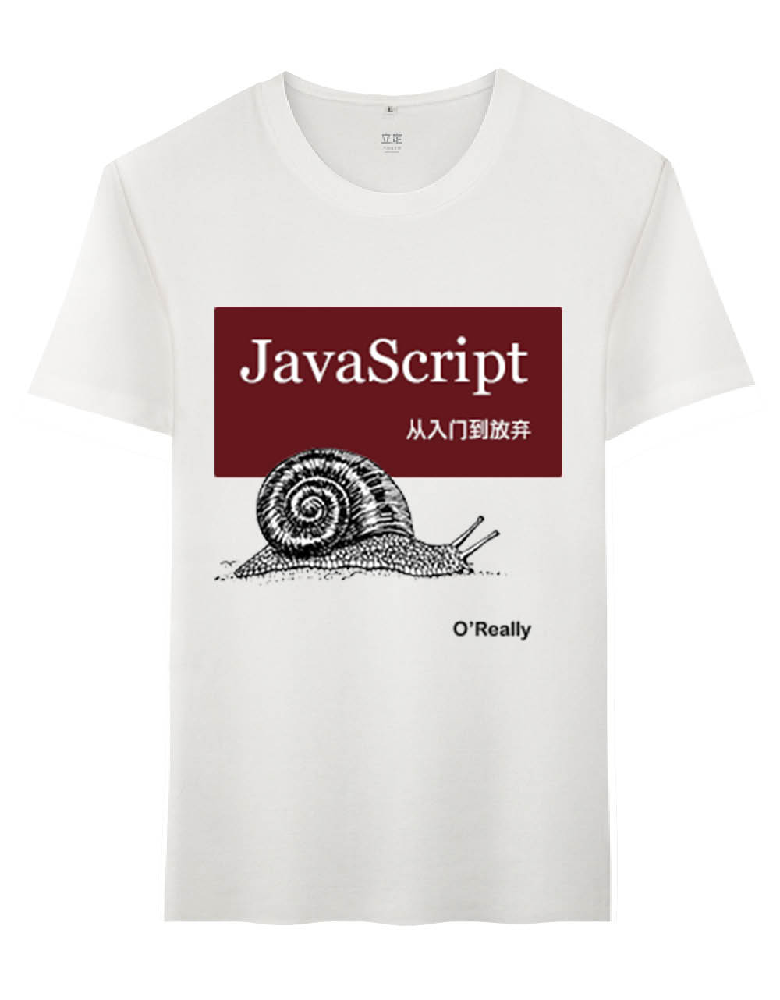
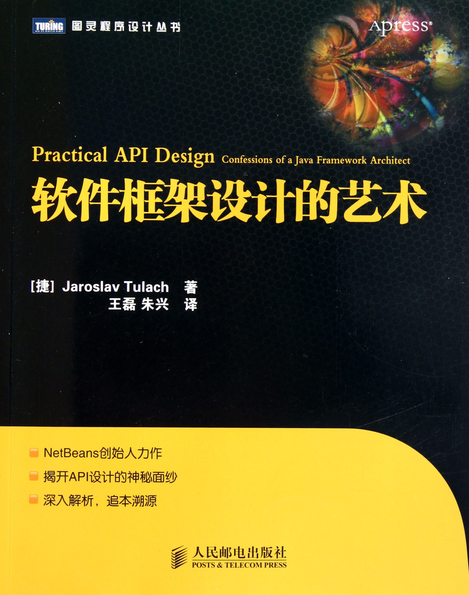

,
JavaScript API 设计案例分析

# JavaScript API 设计案例分析

JavaScript
API 设计
案例分析

##	Introduction of
	my company
	and myself

###	百姓网
	www.baixing.com

分类信息,
58赶集合并后自动排名上升一位,
今年年初已经在新三板上市

Send your resume to
简历请投
heshijun@baixing.com

###	github: @hax
	zhihu: 贺师俊
	weibo: @johnhax

1998年第一次写网页,
2003年某网站技术总监,
2005年某外企软件架构师,
2007年某外企网站系统甲方,
2010年盛大创新院研究员……,
盛大电子书Web框架研发工程师,
2012年百姓网唯二的前端工程师,
2016年百姓网架构组Web前端之一

Title不重要,
重要的是：

找到自己,
真正想做的事情

### 工作

Job,
差事

Career,
职业

Vocation,
Calling

事业,
使命

调用、呼叫,
呼唤、召唤


### MY CALLING

前端
JS

####	极客邦 QCon全球软件大会,
- QCon北京2015：《ES6实战》，明星讲师
- QCon上海2015：“新时代的前端”专题，优秀出品人
- 《JavaScript: The World's Best Programming Language》
- QCon北京2016：《如何看待left-pad事件》
- “编程语言实战”专题代班主持人
- QCon上海2016（10月20日）：前端专题出品人

[johnhax.net/events](http://johnhax.net/events)
[zhihu answers timeline](https://www.zhihu.com/people/he-shi-jun/answers)
[github public activity](https://github.com/hax?tab=activity)

##	极客邦训练营,
	讲个什么主题？

永不止步的前端,
前端技术本身的进化,
前端工程师的成长

普通前端工程师,
高级前端工程师,
资深前端工程师,
前端架构师

从普通到资深……


[JavaScript 从入门到放弃](http://www.ituring.com.cn/article/213937)

从普通到
资深

从用 API 到……,
设计实现 API

API 设计

JavaScript
API 设计
案例分析

### 常见的JS API
- JS builtins
- DOM
- jQuery
- Underscore
- Node.js
- ...

DOM 难用吗？,
为什么难用？

jQuery 好吗？,
为什么好/不好？

[jQuery会过时吗？](https://www.zhihu.com/question/34892985),
0. 发扬光大了$和CSS选择器的天才idea
0. 处理浏览器的兼容性问题和各种bug
0. 链式调用为核心的DSL（此为独创）
0. 基于jQuery的生态（插件，IDE支持）

### 如何评价？

简单
优雅
爽
……

主观感受

客观标准

### 什么是 API ？

Application
Programming
Interface

### 为什么需要 API ？

方便使用,
协作开发,
沟通交流,
模块化

###	API设计与单纯实现功能不同,
	前端和后端不同,
	界面和实现不同,
	API不是给机器用的

缺乏训练,
缺乏实践经验,
缺乏理论探讨

缺乏样板,
JS内建API太少,
DOM公认不好用,
jQuery有争议,
库和框架……,
变化太快了！
<!--	即使只使用如jQuery等主流库和框架，在稍大一些的项目中，我们迟早会面临设计给他人使用的公共接口的问题——即所谓API设计。与单纯实现功能不同，API设计有一些独特的问题，但开发者普遍缺少这方面的训练——从实践经验到理论探讨都很缺乏，甚至连评估一个API设计的好坏都很难。特别是，JavaScript是一门非常灵活的语言，又缺乏足够丰富的标准库作为样板，因此关于JavaScript编程中API设计的讨论往往最终归结为“风格”甚至“喜好”等主观因素。这次分享就想通过一些案例来探讨JavaScript的API设计中的一些问题，并希望能归纳出一些“客观”标准，或至少能建立一个针对此问题领域的分析框架。-->

## PAD



###	Cluelessness
	无绪

即使对事物的内在本质并不清楚
也可以很好的使用它


电视,
汽车

软件,
手机

高级语言,
数据库,
算法

……

不同层次的理解

- 用户
- 维修人员
- 开发人员
- 架构师

### 选择性无绪

编程不是火箭科技,
程序员不是科学家

软件工程中的无绪是指：,
程序员无需深入了解很多内容
也可写出好的代码

找到一种编程实践方法,
让开发人员不用深入了解所有事情,
即选择他们所需的知识

API 是对所需知识的抽象
它将系统的复杂性隐藏起来

Application
Programming
Interface

方便使用
协作开发
沟通交流
模块化
<!-- 即使某人对某一样事物的内在本质并不清楚，也可以很好的使用该事物。如大部分人都不知道电视机的原理，但并不妨碍大家使用电视机观看电视。同样的，开发人员不需要知道某个组件或模块的内在实现原理，也可以很好的使用该组件或模块对外提供的API来完成自己所需的功能。-->

### 评价API好坏的标准
- 可理解性
- 一致性
- 可见性
- 简单性
- 保护投资

#### 可理解性,
理解目标用户,
熟悉的概念模型,
常见需求的示例代码

### 一致性,
能举一反三,
尽量避免特例,
演进时也要一致

### 可见性,
搞不清楚怎么用,
千头万绪不知从何下手,
最好有个入口

### 简单性,
简单任务应该有
简单的方案,
不同目标分解到
不同的API

### 保护投资,
保持前后兼容性,
提升互操作性,
可扩展，构建生态


##	JS API 设计案例分析之
	jQuery

### 之前总结的 jQuery 的亮点
0. 发扬光大了$和CSS选择器的天才idea
0. 处理浏览器的兼容性问题和各种bug
0. 链式调用为核心的DSL（此为独创）
0. 基于jQuery的生态（插件，IDE支持）

- 可理解性
- 一致性
- 可见性
- 简单性
- 保护投资

- 可理解性：Selector
- 一致性：链式调用
- 可见性：$
- 简单性：write less, do more
- 保护投资：对比Dojo、YUI……

大家来找茬！

###	jQuery的槽点

### 总结一些 jQuery 可能的槽点
- $ VS $$
- Plugins VS Modules
- 重载形式的 accessor
- Null object pattern
- Promise 实现问题
- 操作HTML的XSS安全风险

- 可理解性
- 一致性
- 可见性
- 简单性
- 保护投资

- $ VS $$：简单性（选单个元素）、可理解性（性能）、可见性（事件委托）
- Plugins VS Modules：一致性（互操作性）、保护投资（冲突）
- 重载形式的 accessor：一致性（链断了、overload语义）
- Null object pattern：可理解性（null？为啥不起作用？）
- Promise 实现问题：一致性（捕捉异常的语义、互操作性）
- 操作HTML的XSS安全风险：可理解性（为啥XSS了？）、保护投资

## JS API 问题案例
1. jQuery 的槽点
2. getElementsByClassName
3. Prototype 扩展
4. 抛异常 VS 静默失败
5. Lazy function definition pattern
6. DSL 设计之 Route
7. DSL 设计之 占位符

### 坑爹的 getElementsByClassName,
Prototype 1.6 开始被
deprecated，因为：,
native implementations return a
`NodeList` rather than an `Array`

问题出在哪里？
如果回到当初？

- 可理解性
- 一致性
- 可见性
- 简单性
- **保护投资**

### Object.prototype 的禁忌,
为什么所有人都告诫你**不要**
修改`Object.prototype`？

prototype的修改是全局性的,
和global变量一样,
甚至更糟糕……

不改`Object.prototype`但修改其他
built-in对象的prototype如何？

与未来API可能冲突,
例子：String#repeat/trim/padXXX,
例子：Array#~~contains~~includes

- 可理解性
- 一致性
- 可见性
- 简单性
- **保护投资**

为什么 ES5、ES6 新增的方法
都是形如`Object.func(obj)`
而不是`obj.method()`

- 可理解性
- 一致性
- 可见性
- 简单性
- **保护投资**

- 可理解性
- **一致性**
- 可见性
- 简单性
- 保护投资


###	对于不支持的功能应该
	抛异常还是静默失败？

[shim是应该抛异常还是应该fail silently？](http://hax.iteye.com/blog/1146699)

- **可理解性**
- 一致性
- 可见性
- 简单性
- **保护投资**

### [Lazy function definition pattern](http://peter.michaux.ca/articles/lazy-function-definition-pattern)

### [改写函数实际上违背了FP的无副作用的精神](http://hax.iteye.com/blog/113778)

- 防御性编程习惯不是借口，文档不是借口
- 开发者不会预期函数引用会变化
- 就算API作者写了文档，开发者也不会看
- 就算开发者看了文档，也未必注意和理解这对代码的影响

- **可理解性**
- 一致性
- 可见性
- 简单性
- 保护投资

### URL routing DSL

```python
// 某Python Web框架
urlpatterns = patterns(<i>''</i>,
	(r<i>'^articles/(?P&lt;year&gt;\d{4})/$'</i>, views.year_archive),
	(r<i>'^articles/(?P&lt;year&gt;\d{4})/(?P&lt;month&gt;\d{2})/$'</i>, views.month_archive),
)
```

```groovy
// Grails
static mappings = {  
	<i>"/articles/$year/"</i> (view:<i>'year_archive'</i>) {  
		constraints { year(matches:<i>/\d{4}/</i>) }  
	}  
	<i>"/articles/$year/$month"</i> (view:<i>'month_archive'</i>) {  
		constraints {  
			year(matches:<i>/\d{4}/</i>)  
			month(matches:<i>/\d{2}/</i>)  
		}  
	}  
}  	
```

URL“/articles/2009/06/”返回的页面为2009年6月的存档
```python
(r<i>'^articles/(?P&lt;year&gt;\d{4})/(?P&lt;month&gt;\d{2})/$'</i>, views.month_archive)
```
```groovy
<i>"/articles/$year/$month"</i> (view:<i>'month_archive'</i>) {  
	constraints {  
		year(matches:<i>/\d{4}/</i>)  
		month(matches:<i>/\d{2}/</i>)  
	}
}
```

### 正则表达式 VS 内嵌变量的字符串
- 可理解性
- 一致性
- 可见性
- 简单性
- 保护投资

### 正则表达式 VS 内嵌变量的字符串
- **可理解性**
- 一致性
- 可见性
- **简单性**
- 保护投资


### “_”作为占位符

```js
function f(a,b,c) {...};
var f1 = f.curry(x);         /* f1(b,c) -> f(x,b,c) */
var f2 = f.partial(_, x);    /* f2(a, c) -> f(a, x, c) */
var f2 = f.partial(_, _, x); /* f2(a, b) -> f(a, b, x) */
```

### 用`undefined`作为占位符而不是“_”如何？

参数本身是 undefined 怎么办？

在调用`f.partial(x, undefined, y)`时，
x或y的值发生错误导致传入了undefined怎么办？

- 可理解性
- 一致性
- 可见性
- 简单性
- 保护投资

- 可调试/错误处理
- 健壮性（edge case）
- 正确性（类型理论）

- 安全性
- 性能

## 总结

API 的目的是让开发者
可以选择性无绪

从“选择性无绪”出发
可理解性 一致性 可见性
简单性 保护投资等标准

即使是看似主观的风格问题
也可以按照标准结合情境
进行客观的分析和评价的

注意JavaScript的特点
如动态语言特征
如历史遗留的缺陷
如ES5、ES6新特性
带来的API设计的进化等

## 异步编程模型

Callback
Promise
Async&Await

Thunk
Fiber
Monad

- 可理解性
- 一致性
- 可见性
- 简单性
- 保护投资

[Why Callback/Thunk Sucks and Promise Rocks](https://github.com/hax/hax.github.com/issues/11)

## JavaScript API 的未来趋势

,
