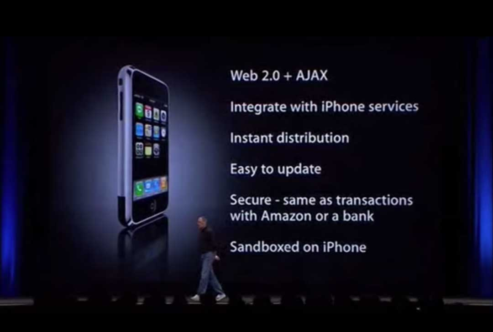

SFDC
杭州开发者大会 2016-12-10

#	JS@2017
	[johnhax.net/2016/JS@2017](http://johnhax.net/2016/JS@2017/)

##	Introduction of
	My Company
	and Myself

百姓网
www.baixing.com

新三板上市,
我们在招人

`/* zi-chui-zi-lei */`
自我介绍
[zhuanlan.zhihu.com/p/23870345](https://zhuanlan.zhihu.com/p/23870345)

github: @hax
zhihu: 贺师俊
weibo: @johnhax
[johnhax.net/events](http://johnhax.net/events)

##	高橋流
	簡報法
	Takahashi Method

Ruby

高桥征义

高橋流

“人生的忠告”

## 关于“黑”

“不友善”

争议性
Controversial subject

But

我就是认真
it's not about victory, it's all about attitude

争议性
Controversial subject

程序员的圣战之
TAB vs SPACE

JavaScript
The World's Best
Programming Language

黑

被黑

看到 the best
要么是眼界太窄
要么就是有病

有病

##	JavaScript
	The World's Best
	Programming Language

The World's
Best

Popular

GitHub,
[Trending](https://github.com/trending)

语言特性
表达能力

先天不足

ES6+

性能

JS是最快的,
动态语言

还会更快

Competition,
within largest companies

Competition
Cooperation

语言、平台,
得靠爹

一群干爹

Google, Microsoft
Apple, Facebook

V8

AngularJS
Polymer

PWA

Chakra

TypeScript

Rx

WSH, ASP, HTA
JScript.NET
Gadgets

HWA

SFX (Nitro)

OSX Automation

React,
Native

Nuclide

Reason

给OCamel
披上JS外衣

Yarn

Babel

hardest to upgrade ->,
Always use
latest feature!

好不好,
得实践

正向反馈

生态

语言生态

库的生态

先天不足

野蛮生长

模块机制,
包管理器

自由竞争

爆发

164,234
packages

183,668
packages

195,117
packages

364,935
packages

[modulecounts.com](http://www.modulecounts.com/)

平台生态

JS as a
Platform

- CoffeeScript
- TypeScript
- Elm
- Clojure

JS社区吸收其他
语言社区的精华

Python

Generators

CoffeeScript

Arrow functions
Destructuring

Clojure

Immutable.js

Elm

Redux

Rx

JS社区对其他
语言平台的影响

Node.js

Swoole

Async

Promise

Async/Await

生态

JavaScript have:

The most ubiquitous platform:,
Browser

The most active platform:,
Node.js

The largest companies:,
Google, Microsoft
Apple, Facebook

The largest developers
Community

##	ECMAScript
	标准演进

- ES3: 1999年12月
- ~~ES4~~: 废弃
- ES5: 2009年12月

- ES2015 (ES6) 去年6月
- ES2016 (ES7) 今年6月
- ES2017 (ES8) 明年6月

## ES6 主要特性总结

  - module
  - class
  - const/let
  - arrow function
  - Symbol, well-known symbols
  - iterator, generator, for-of
  - Promise

  - destructuring, default value
  - spread, rest param
  - template string
  - Set/Map/WeakSet/WeakMap
  - Proxy
  - 内建对象的扩展
  - ……

浏览器支持情况
[ES2015](http://kangax.github.io/compat-table/es2016plus/)

## ES2016+ 有些什么新特性？
[TC39 Finished Proposals](https://github.com/tc39/proposals/blob/master/finished-proposals.md)
[TC39 Stage 3 Proposals](https://github.com/tc39/proposals)

浏览器支持情况
[ES2016+](http://kangax.github.io/compat-table/es2016plus/)

- async/await
- async generators, for await of
- import()
- SIMD
- SharedArrayBuffer, Atomics

SIMD
单指令多数据流,
[举个🌰](https://www.zhihu.com/question/27768721/answer/76380979)

Babel 跟进

- [preset-es2015](http://babeljs.io/docs/plugins/preset-es2015/),
- [preset-es2016](http://babeljs.io/docs/plugins/preset-es2016/)
- [preset-es2017](http://babeljs.io/docs/plugins/preset-es2017/)
- [preset-latest](http://babeljs.io/docs/plugins/preset-latest/)
- [preset-stage-3](http://babeljs.io/docs/plugins/preset-stage-3/)
- [preset-env](https://github.com/babel/babel-preset-env)

- Web 新标准已经全面基于 ES6+
- 组件框架已经全面转向 ES6+
- 工具链、IDE等已经全面支持 ES6+

## The Next Big Thing?

- module
- decorator
- private

WebAssembly

“Everything that *can* be
written in JavaScript *will*
eventually be written in
JavaScript”. — Atwood’s law

“Everything that *not*
written in JavaScript
*will* eventually be run
in JS/WASM Engine”.
— Hax’s ~~law~~ prediction

勿谓言之不预也

## 后端

Node.js

Node 4.2.0
Argon LTS
（2015年10月）

Node 5.0
npm 3
（2015年10月）

Node 6.0
（2016年4月）

Node 6.9.0
Boron LTS
（2016年10月）

Node 7.0
（2016年10月）

稳定

The Next Big Thing?

ES6 module

promise化

- Stream
- WebWorker
- URL

Ecosystem Automation

## 前端框架

### React

同构

redux

mobx

The Next Big Thing?

fiber

### Ng

TypeScript

Rx

### Vue

The Next Big Thing?

Cycle.js

## 移动端

Cordova

NativeScript

Weex

PWA

微信小程序

## 桌面端

Electron
(atom-shell)

## IDE

[Atom](https://atom.io/)

2015年6月
在发了211个0.x版本之后
发布了1.0

[Nuclide](https://nuclide.io/)

- 2015年6月对外发布
- 2016年1月开始以单一包发布

[VSCode](https://code.visualstudio.com/)

- 2015年4月发布Preview
- 2015年11月以MIT协议在GitHub上开源
- 2016年4月发布1.0

## IoT

mqtt.js

NodeBots

Netbeast

Ruff.io

## 其他领域

游戏

数据可视化

VR/AR

WebVR
WebRTC
Three.js

## 最后谈点问题

leftpad
[johnhax.net/2016/all-about-left-pad](http://johnhax.net/2016/all-about-left-pad/)

2016怎么写JS

JS fatigue

[The State of JS](http://stateofjs.com/2016/introduction/)

#	JS@2017
	[johnhax.net/2016/JS@2017](http://johnhax.net/2016/JS@2017/)

QA

###	github: @hax
	zhihu: 贺师俊
	weibo: @johnhax
