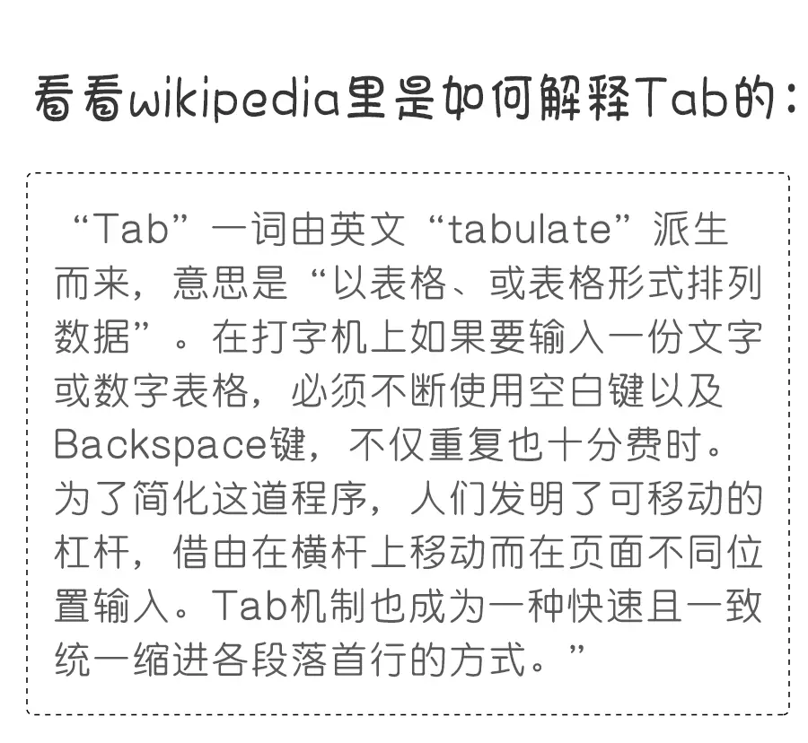
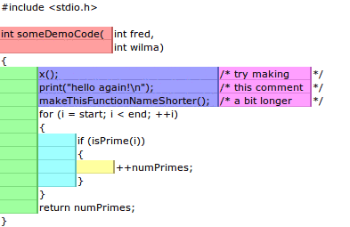

# TAB vs SPACE
	________________________________
	（观赏本 slide 请使用 Chrome 45+ 等支持 ES6、Fetch API 等新特性的浏览器）

by Hax

今年做了很多演讲，比如,
JavaScript: The World's Best
Programming Language

争议性

回避,
嘲笑

值得讨论

Coding Style

## 重要吗？

Significant?

OR

Trivial?

Trivial
其实并没有那么重要

代码逻辑,
模块划分,
架构设计,
……

命名

##	既然并不是最重要
	那么为什么要有
	Coding Style？

积沙成塔
集腋成裘

Programming-in-the-large

个人作坊 => 团队协作,
一次性项目 => 长期演化

一个人随便 => 一群人痛苦,
一夜的潇洒 => 一生的痛苦

一屋不扫
何以扫天下

clean code
意识和习惯

解决 trivial 问题
是为了更好的集中精力解决
significant 问题

code review
不要浪费时间
在琐碎的事情

## TAB vs SPACE

A. 信仰鉴定纯正的Tab党
B. 虽然我用空格，但我是被迫的
C. 信仰鉴定纯正、完全志愿加入的空格党
D. 投票是匿名的，我Tab和空格混着用

A. 信仰鉴定纯正的Tab党
B. 虽然我用空格，但我是被迫的
C. 信仰鉴定纯正、完全志愿加入的空格党
D. 投票是匿名的，我Tab和空格混着用

神秘的程序员们

coderstory

TAB vs SPACE

TAB的优点/SPACE的缺点
- 语义更符合逻辑
- 节省存储
- 宽度自定义
- 节省按键次数
- 开头注释不破坏对齐

TAB的优点/SPACE的缺点
- 语义更符合逻辑
- ~~节省存储~~
- 宽度自定义
- ~~节省按键次数~~
- ~~开头注释不破坏对齐~~

SPACE的优点/TAB的缺点
- 所有编辑器下看起来都一样！
- 大公司都用空格缩进
- 可以搞ASCII画

SPACE的优点/TAB的缺点
- ~~所有编辑器下看起来都一样！~~
- ~~大公司都用空格缩进~~
- ~~可以搞ASCII画~~

SPACE的真正优点,
对齐

然而

SPACE对齐的缺点,
- 牵一发而动全身
- 维护起来很繁琐
- 略干扰代码审查
- 必须monospace

Elastic Tabstops
解决上述所有问题,
完美

完美

~~完美~~

Elastic Tabstops的缺点,
缺乏
IDE/编辑器
支持

然并卵

- Visual Studio（扩展，by 原作者）
- Code Browser（Windows only）
- jEdit
- Golang（tabwriter package）
- Sublime（插件，“lite”版）
- ACE（“lite”版）

正确实现 Elastic Tabstops
需要动编辑器核心

当前最佳实践
Use TAB for Indentation
Use Blanks for Alignment

我的选择,
Use TAB for Indentation,
~~Use Blanks for Alignment~~
No Alignment

等待Elastic Tabstops
获得更多IDE/编辑器的支持

~~等待~~Elastic Tabstops
获得更多IDE/编辑器的支持

推动Elastic Tabstops
获得更多IDE/编辑器的支持

GitHub 插件
[hax/etab](https://github.com/hax/etab)

Atom 插件
[hax/atom-elastic-tabstops](https://atom.io/packages/elastic-tabstops)

不清楚和有争议的可以@我
github: @hax
zhihu: 贺师俊
weibo: @johnhax

http://johnhax.net/2016/tab-vs-space/
Q & A
