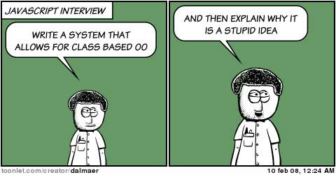

#	ES2017 实战
	http://johnhax.net/2016/yufe

##	Introduction of
	My Company
	and Myself

百姓网
www.baixing.com

github: @hax
zhihu: 贺师俊
weibo: @johnhax

知乎 Live,
11月30日周三晚上

模拟面试,
[前端们，贺老 Live 面试你了！](https://zhuanlan.zhihu.com/p/23870345)

（误）

前端面试题,
来自日常工作的案例,
2013年到2015年间

面试官、准面试官 => 面试思路,
初中级前端工程师 => 自我评估,
学生、前端实习生 => 开拓视野

知乎 Live,
收费

模拟面试
[前端们，贺老 Live 面试你了！](https://zhuanlan.zhihu.com/p/23870345)

需要交多少
赞助费？

64元

~~64元~~

255元

现在赞助
只需64元

广告还有30秒结束

模拟面试得高分,
直接获得百姓网内推机会,
或者可获得我的公开推荐

正直坦诚
永远是程序员的第一准则

#	ES2017 实战
	http://johnhax.net/2016/yufe

##	ECMAScript
	标准演进

- ES3: 1999年12月
- ~~ES4~~: 废弃
- ES5: 2009年12月

- ES2015 (ES6) 去年6月
- ES2016 (ES7) 今年6月
- ES2017 (ES8) 明年6月

## ES6 主要特性总结

  - module
  - class
  - const/let
  - arrow function
  - Symbol, well-known symbols
  - iterator, generator, for-of
  - Promise

  - destructuring, default value
  - spread, rest param
  - template string
  - Set/Map
  - Proxy
  - 内建对象的扩展
  - ……

## ES2016+ 有些什么新特性？
[TC39 Finished Proposals](https://github.com/tc39/proposals/blob/master/finished-proposals.md)
[TC39 Stage 3 Proposals](https://github.com/tc39/proposals)

SIMD
单指令多数据流,
[举个🌰](https://www.zhihu.com/question/27768721/answer/76380979)

浏览器支持情况
[ES2015](http://kangax.github.io/compat-table/es2016plus/)
[ES2016+](http://kangax.github.io/compat-table/es2016plus/)

Babel 跟进

- [preset-es2015](http://babeljs.io/docs/plugins/preset-es2015/),
- [preset-es2016](http://babeljs.io/docs/plugins/preset-es2016/)
- [preset-es2017](http://babeljs.io/docs/plugins/preset-es2017/)
- [preset-latest](http://babeljs.io/docs/plugins/preset-latest/)
- [preset-stage-3](http://babeljs.io/docs/plugins/preset-stage-3/)
- [preset-env](https://github.com/babel/babel-preset-env)

- Web 新标准已经全面基于 ES6+
- 组件框架已经全面转向 ES6+
- 工具链、IDE等已经全面支持 ES6+

DEMO

QA

###	github: @hax
	zhihu: 贺师俊
	weibo: @johnhax

[Live 面试](https://zhuanlan.zhihu.com/p/23870345)
11月30日周三晚上
