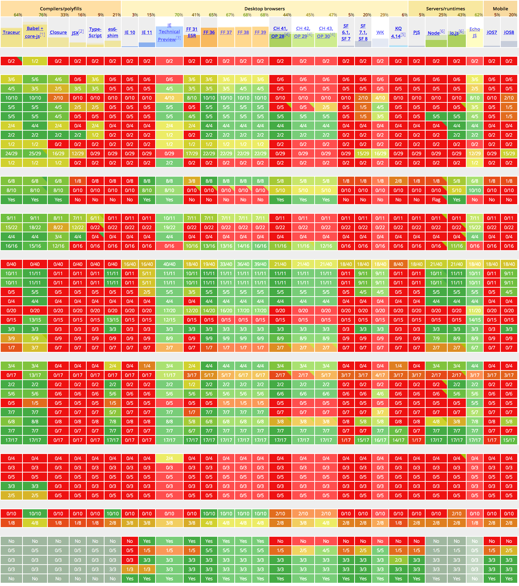
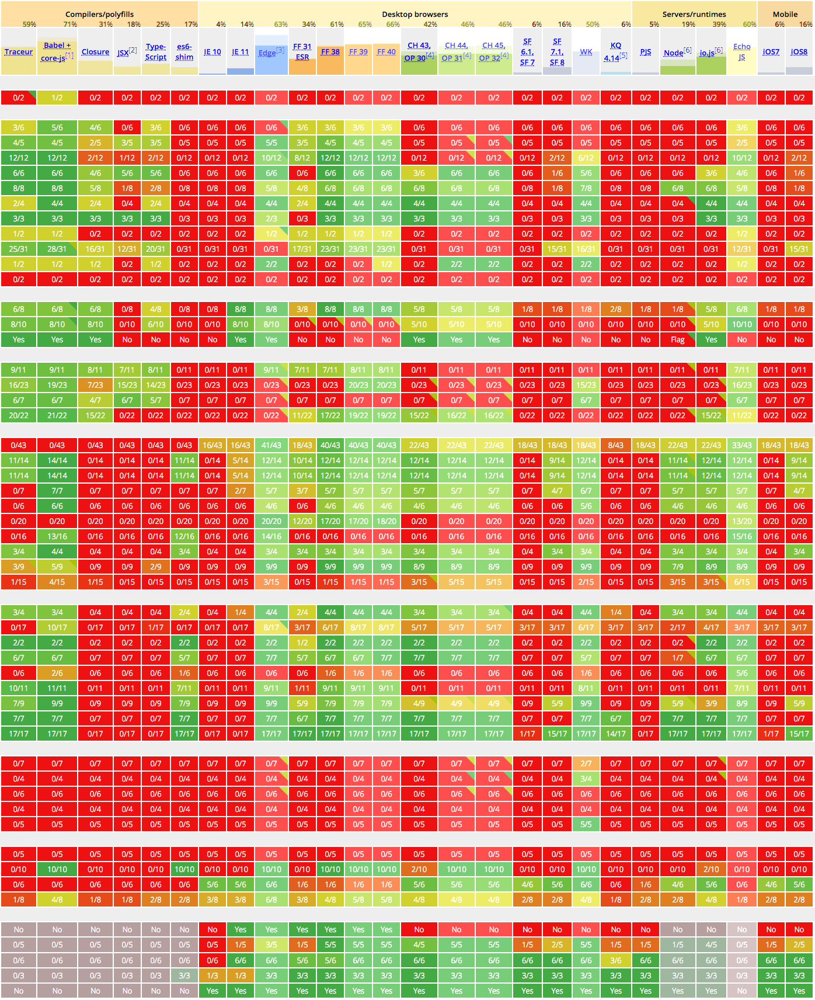
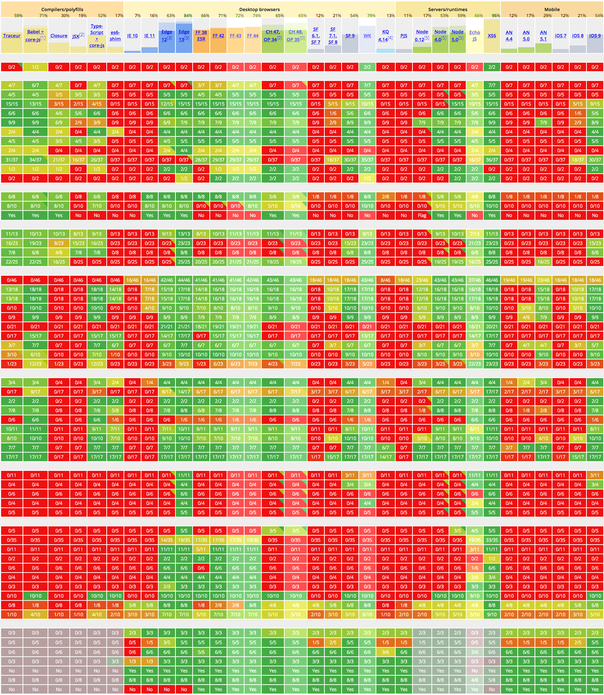
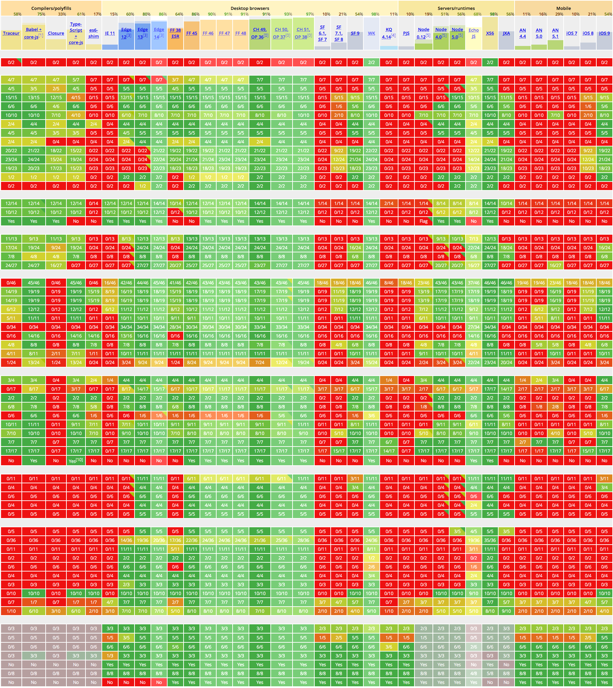
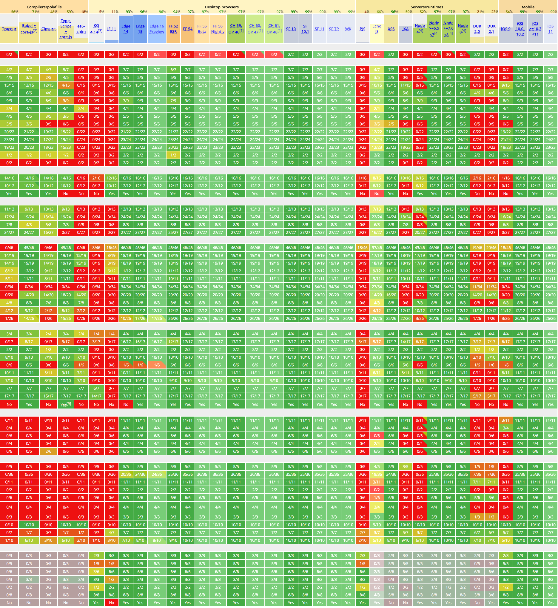
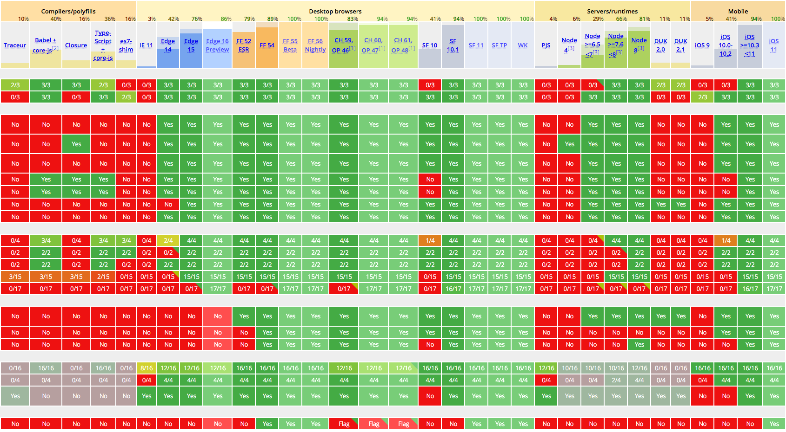

后 ES6 时代的
JavaScript 语言
----------------------------------------
[johnhax.net/2017/es6+/](http://johnhax.net/2017/es6+/)

我

贺师俊

hax

百姓网
www.baixing.com

百姓网
架构部

github: @hax
zhihu: 贺师俊
weibo: @johnhax

1998

JavaScript

IE 4

一个写了20年JS的男人

- [2011/8 &nbsp; ES5 — Improve the Safety of JS](http://v.youku.com/v_show/id_XMjkwNjc2Nzgw.html)
- [2014/12&nbsp; 透过ES6看JS未来](http://johnhax.net/2014/es6-js-future/)
- [2015/4 &nbsp; ES6实战](http://www.infoq.com/cn/presentations/es6-actual-combat)
- [2015/7 &nbsp; JS — The World's Best Programming Language](http://johnhax.net/2015/js-the-best/)
- [2016/8 &nbsp; 代码时间podcast之 ES2015](https://codetimecn.com/episodes/es2015)
- [2016/12&nbsp; JS @ 2017](http://www.itdks.com/dakashuo/detail/364)
- [2017/4 &nbsp; 编程语言如何演化 —— 以JS的private为例](http://johnhax.net/2017/js-private/)
- [2017/4 &nbsp; STC vs PTC](http://v.youku.com/v_show/id_XMjc0NDQ3MDI1Ng==.html?f=49711130&o=0&spm=a2h1n.8251843.playList.5!3~5~A)
- [2017/7 &nbsp; 后ES6时代的JS语言](http://johnhax.net/2017/es6+/)
- 2017/8 &nbsp; JavaScript — 世界第一程式設計語言

- 2018/1 &nbsp; JS @ 2018
- 2018/4 &nbsp; ES9实战
- 2018/7 &nbsp; 后ES7时代的JS语言
- 2018/9 &nbsp; JS — Really The World's Best PL &nbsp; &nbsp; &nbsp; &nbsp;

- 2019/1 &nbsp; JS @ 2019
- 2019/4 &nbsp; ES10实战
- 2019/7 &nbsp; 后ES8时代的JS语言
- 2019/8 &nbsp; JS — Still The World's Best PL &nbsp; &nbsp; &nbsp; &nbsp; &nbsp; &nbsp;

- 2020/1 &nbsp; JS @ 2020
- 2020/4 &nbsp; ES11实战
- 2020/7 &nbsp; 后ES9时代的JS语言
- 2020/8 &nbsp; JS — The World's Best PL as You Wish

后ES6时代的
JS

ES6
ES2015

支持度
[kangax.github.io/compat-table/es6](http://kangax.github.io/compat-table/es6/)











PTC
proper tail calls

[STC vs PTC](http://v.youku.com/v_show/id_XMjc0NDQ3MDI1Ng==.html?f=49711130&o=0&spm=a2h1n.8251843.playList.5!3~5~A)

Array.prototype.values()

ES7+



ES6 已落地,
ES7+ ready

后ES6时代

憋大招
5年半一个大版本
厂商集中实现特性

细水长流
根据提案推进实现
每年发布一个版本

Stage 0 => 4

0. Strawman
1. Proposal
2. Draft
3. Candidate
4. Finished

正式发布标准前
至少有两个实现

ES7+ Features

`**`

`Array.prototype.includes()`

`contains` => `includes`

```js
[NaN].indexOf(NaN)
[NaN].includes(NaN)
```

Trailing commas

```js
function f(
	a,
	b,
	c,
) {
	...
}
```

```js
f(
	a,
	b,
	c,
)
```

- `Object.values()`
- `Object.entries()`,
- `Object.keys()`

- `Object.getOwnPropertyDescriptors()`,
- `Object.getOwnPropertyDescriptor()`,
- `Object.defineProperty()`
- `Object.defineProperties()`

`String.prototype.padStart()`
`String.prototype.padEnd()`

left-pad

[如何看待 left-pad 事件](http://www.infoq.com/cn/presentations/how-to-treat-the-left-pad-event)

`padLeft/Right` => `padStart/End`

Async functions

Shared memory and atomics

单线程？

Worker

消息传递

共享内存


RTC
Run to completion

Async/Await
SharedArrayBuffer

[nodejs/worker/issues](https://github.com/nodejs/worker/issues)

ESM

`import`
`export`

babel/rollup/webpack
module => script

```html
<script src="bundled.js">
</script>
```

```js
// main
require('npm-module')
```

[HTML规范加入了<code>&lt;script type=module&gt;</code>](https://html.spec.whatwg.org/multipage/scripting.html#attr-script-type)
```html
<script type="module" src="./main.js"></script>
<script nomodule src="bundled.js"></script>
```

Safari 10.1,
Chrome 61,
Edge 15+, FF 54+

[ESM in Node](https://github.com/nodejs/node/wiki/ES6-Module-Detection-in-Node)

如何区分 script/module？

ESM 加载 CommonJS
CommonJS 加载 ESM

`__dirname`
`__filename`

耐心等待

未来新特性

`import()`

```html
<!DOCTYPE html>
<nav>
  <a href="books.html" data-entry-module="books">Books</a>
  <a href="movies.html" data-entry-module="movies">Movies</a>
  <a href="video-games.html" data-entry-module="video-games">Video Games</a>
</nav>
<main>Content will load here!</main>
<script>...</script>
```

```js
  const main = document.querySelector("main");
  for (const link of document.querySelectorAll("nav > a")) {
    link.addEventListener("click", e => {
      e.preventDefault();
      import(`./section-modules/${link.dataset.entryModule}.js`)
        .then(module => { module.loadPageInto(main); })
        .catch(err => { main.textContent = err.message; });
    });
  }
```

Rest/Spread
Properties

```js
let { x, y, ...z } = { x: 1, y: 2, a: 3, b: 4 };
x; // 1
y; // 2
z; // { a: 3, b: 4 }
let n = { x, y, ...z };
n; // { x: 1, y: 2, a: 3, b: 4 }
```

Async Iteration

```js
async function* readLines(path) {
  let file = await fileOpen(path);
  try {
    while (!file.EOF) {
      yield await file.readLine();
    }
  } finally {
    await file.close();
  }
}
for await (const line of readLines(filePath)) {
  console.log(line);
}
```

RegExp

- Lookbehind assertions: `(?<=...)` `(?&lt;!...)`
- Unicode property escapes: `\p{UnicodePropertyName=Value}`
- Named capture groups: `(?&lt;year&gt;\d{4})-(?&lt;month&gt;\d{2})`
- dotAll flag: `/foo.bar/s.test('foo\nbar') // -> true`

`global`

Class

```js
class Counter extends HTMLElement {
  clicked() {
    this.x++;
    window.requestAnimationFrame(this.render.bind(this));
  }
  constructor() {
    super();
    this.onclick = this.clicked.bind(this);
    this.x = 0;
  }
  connectedCallback() { this.render(); }
  render() {
    this.textContent = this.x.toString();
  }
}
window.customElements.define('num-counter', Counter);
```

```js
class Counter extends HTMLElement {
  x = 0;
  clicked() {
    this.x++;
    window.requestAnimationFrame(this.render.bind(this));
  }
  constructor() {
    super();
    this.onclick = this.clicked.bind(this);
  }
  connectedCallback() { this.render(); }
  render() {
    this.textContent = this.x.toString();
  }
}
window.customElements.define('num-counter', Counter);
```

```js
class Counter extends HTMLElement {
  #x = 0;
  clicked() {
    this.#x++;
    window.requestAnimationFrame(this.render.bind(this));
  }
  constructor() {
    super();
    this.onclick = this.clicked.bind(this);
  }
  connectedCallback() { this.render(); }
  render() {
    this.textContent = this.#x.toString();
  }
}
window.customElements.define('num-counter', Counter);
```

[编程语言如何演化 —— 以JS的private为例](http://johnhax.net/2017/js-private/)

- Decorators
- Observable
- WeakRefs
- Realms
- do 表达式
- Null Propagation
- 任意精度整数
- export 扩展
- Generator arrow functions

- `String.prototype.matchAll()`
- `String.prototype.trimStart/trimEnd()`
- `Promise.prototype.finally()`
- `Promise.prototype.try()`
- Error stacks
- Math 扩展
- Cancellation API
- `function.sent`
- `import.meta`

[prop-tc39.now.sh](https://prop-tc39.now.sh/)

Pattern Matching

```js
let getLength = vector => match (vector) {
    { x, y, z }: Math.sqrt(x ** 2 + y ** 2 + z ** 2),
    { x, y }:    Math.sqrt(x ** 2 + y ** 2),
    [...]:       vector.length,
    else: {
        throw new Error("Unknown vector type");
    }
}
```

WebAssembly

Q & A
github: @hax
zhihu: 贺师俊
weibo: @johnhax
