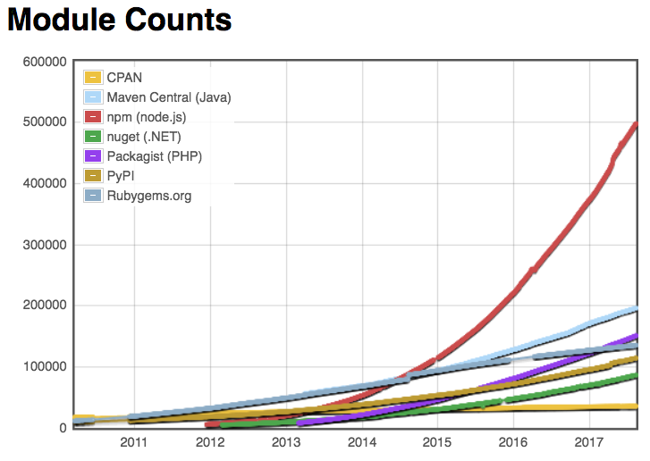
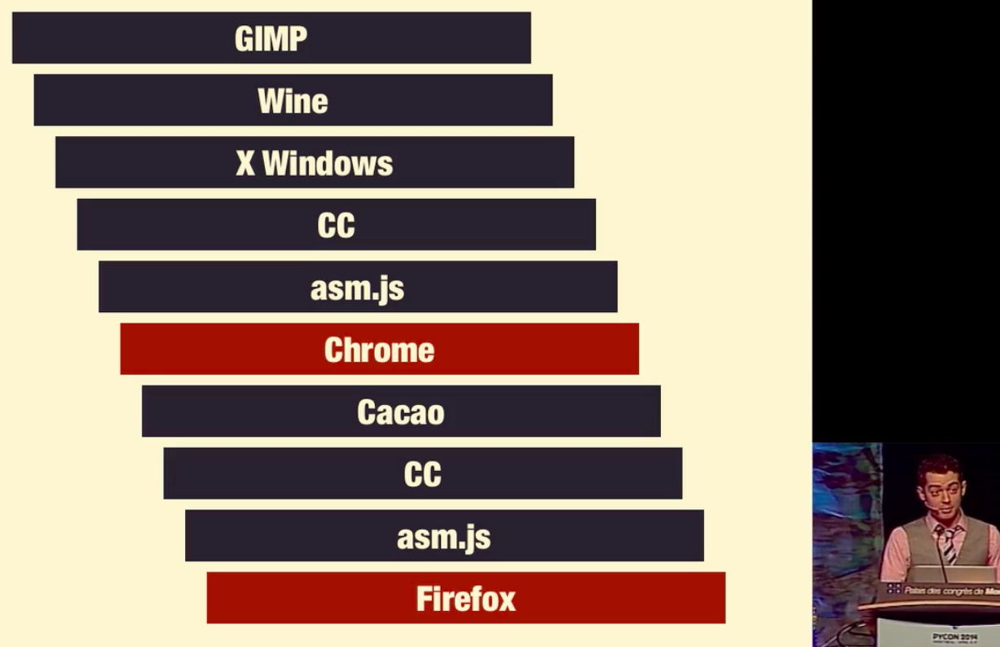

JavaScript
The World's Best
Programming Language
___________________________________
《JS — 世界第一程式設計語言》by Hax

1st


看到 the best 的
要麼是眼界太窄
要麼就是有病

有病

爭議性

自**我**介紹

賀師俊

[github: @hax](https://github.com/hax)
[zhihu: 贺师俊](https://www.zhihu.com/people/he-shi-jun)
[weibo: @johnhax](https://weibo.com/haxy)
[twitter: @haxy](https://twitter.com/haxy)

百姓網
www.baixing.com

分類廣告
Craigslist

Web
前端

Web
標準

[W3C HTML5](https://www.w3.org/html/ig/zh/Overview.html)
[Chinese IG](https://www.w3.org/html/ig/zh/Overview.html)

HTML
[Acknowledgments](https://html.spec.whatwg.org/multipage/acknowledgements.html)


做了
一點**微小**的
工作

JavaScript

**ECMA**Script

- babel
- eslint
- atom
- ...

`..<`

`1 ..< 5`,
`1, 2, 3, 4`

Groovy,
Swift

[Exclusive range](https://github.com/hax/hax.github.com/issues/25)

JS

人吶…
自己就不可以**預料**

演講

高橋流
簡報法
Takahashi Method

Ruby

高橋
征義

高橋流


EVA 模式


挑戰,
**爭議**性

[程序員的聖戰之](/2016/tab-vs-space/)
[TAB vs SPACE](/2016/tab-vs-space/)

編程語言

態度

兩種
極端

你用什麼語言？


語言都一樣！


人們總是

高估短期
低估長期

不太可能是
專案成敗的
決定性因素

影響團隊
長期效能

編程語言

各位心目中的
世界**第一**

候選

C,
C++

Java,
C#

Lisp,
Scheme,
Haskell

Perl,
Python,
Ruby

Erlang,
Go,
Swift,
Rust


成百上千種編程語言,
我一定會遺漏…

PHP

JS?

Long long ago...

16 Years ago


Douglas
Crockford


Why
“most misunderstood”

- Design Errors
- Bad Books
- Amateurs


Good
Parts


JS is GOOD
enough in 2001,
If u as **smart** as DC

ES4

Adobe
ActionScript 3

[Tamarin](https://en.wikipedia.org/wiki/Tamarin_(software))

Yahoo!
Microsoft

ES 3.1

ES5

JS do not need Class,
JS do not need Module,
JS do not need `this` keyword,
JS do not need `Object.create()`,
(`Object.create()` is invented by DC),
JS do not need XXX

DC: JS is GOOD enough

I do **NOT** agree

My real feeling (before 2008):,
JS is world's **worst**
programming language,
*&nbsp; &nbsp; &nbsp; &nbsp; ...except PHP* 😝

And you have
**NO Choice**
If u r a web fe engineer

Language feature
Matters

For Example:,
No module mechanism,
-> everyone invent own wheel,
-> community is break,
-> unfair competition,
-> the Matthew Effect,
-> jQuery rules all

jQuery is
**great**

Only jQuery
is **NOT** great

QConBeijing 2010

DC replyed:

You could write module proposal
**yourself** and send it to TC39...


But DC and I
didn't know

There is already some
**great** thing rised...

Node.js

0.1.x

CommonJS

npm

164,234
packages

183,668
packages

195,117
packages

498,267
packages

2017-8-14

**5**00,000



Not too perfect

CommonJS

Growth

Proof

Hax **+1**
DC **-1**

ES Modules

A fault
on the **right** side

Single thread, async,
Event driven, callbacks

No standard library,
No burden

Emerging
in the **wild**

Promise

```js
sleep(1000).then(() => ...)
```

```js
function sleep(ms) {
	var deferred = new Deferred()
	setTimeout(() => deferred.resolve(), ms)
	return deferred.promise
}
```

```js
function sleep(ms) {
	return new Promise(r => setTimeout(r, ms))
}
```

Summary of
Pre-ES6

Browsers,
Node.js

Killer
Application

Killer
Platform

歷史
進程

個人
奮鬥

ES **Harmony**

New Language features,
Fix many problems

Class,
fix OO in JS

Arrow functions,
fix `this` binding

Map, Set ...,
fix data structure

for...of,
fix for...in

async/await
fix callback hell

More new features...

Language features are
Important
for **productivity**

C

Abstraction
has **COST**

Example

Monad,
How many people understand Monad?

A monad is just a **monoid** in
the **category** of **endofunctors**
單子說白了不過就是**自函子**
**範疇**上的一個**么半群**而已,
What's the problem?
這有什麼**難**以理解的？


Does JavaScript
have Monad?

Yes

Eg. Promise

You do NOT need to
know Monad
aka monoid in the category of endofunctors
to use Promise

Haskell

Compatibility

JS should be
the **worst** case

You can NOT
use new features
until ALL users
upgrade their browsers

Polyfills,
Only for APIs

CoffeeScript

[Compile-to-JS](https://github.com/jashkenas/coffeescript/wiki/list-of-languages-that-compile-to-js)
Production

Babel

Babel makes the language
**Modular**

- es6-module-transpiler
- JSX

- Parser: Code -> AST
- Transformers: AST -> AST
- Generators: AST -> Code

Coordination
Lower cost

Plugins
Presets

ES201X preset

22% stage 4
20% stage 3
25% stage 2
**33%** stage 0/1

Enable language features
incrementally

Hardest to upgrade,
-> Always use
**latest** feature!

Python

C++ 11

PHP 7

Negative
feedback loop

Language evolution is
Hard

Feedback
from production

Wait until
**stable**

Dead Lock

Try new features
Feedback
Experiment

Production

Positive
feedback loop

Lisp

Macro

Not need
Babel

[The Lisp Curse](http://winestockwebdesign.com/Essays/Lisp_Curse.html)

Lisp is so powerful that problems
which are technical issues in
other programming languages
are **social issues** in Lisp

Linting
Formatting
Minification
Codemods
Code coverage

babel-plugin-*

1800+

Performance

JavaScript is the
fastest
dynamic language!

Why?

Competition,
within **largest** companies

Competition
Cooperation

Optional static type
Angular(Google) use TypeScript(MS)

WebAssembly
Google, Mozilla, Apple, Microsoft

JavaScript will be
fast**er**
in the future

My expectation:
JavaScript will be
as FAST as Java

Ruby

JS as a
Platform

“Everything that *can* be
written in JavaScript *will*
eventually be written in
JavaScript”. — Atwood’s law

asm.js

SharedArrayBuffer/Atomics

Multi-core
Parallelism

The Birth & Death
of JavaScript
A talk by **Gary Bernhardt** from PyCon 2014




WebAssembly

W3C WebAssembly
Working Group

Java
.NET

All of above,
is **NOT** important

Ecosystem

JavaScript have:

The most **ubiquitous** platform:,
Browser

The most **active** platform:,
Node.js

The **largest** companies:,
Google Microsoft
Apple Facebook

The most experienced experts
in the language committee,
---------- & ----------,
The largest developers
Community

JavaScript
The World's Best
Programming Language
___________________________________
《JS — 世界第一程式設計語言》by Hax

Thank you!
[johnhax.net/2017/modern-web](http://johnhax.net/2017/modern-web/)
