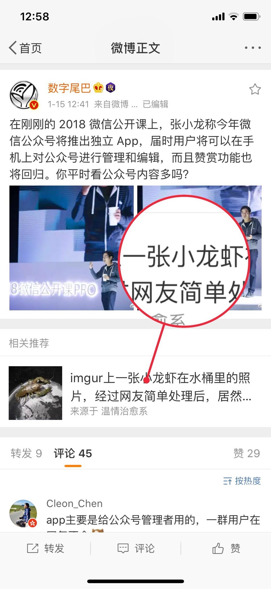

PWA vs WXA
------------------------------
[johnhax.net/2018/pwa-vs-wxa/](http://johnhax.net/2018/pwa-vs-wxa/?slide)

PWA
[Progressive Web Apps](https://developers.google.com/web/progressive-web-apps/)

[Hux：PWA 复兴序章](https://huangxuan.me/2016/10/20/pwa-qcon2016/)

- [下一代 Web 应用模型 —— PWA](https://huangxuan.me/2017/02/09/nextgen-web-pwa/)
- [饿了么的 PWA 升级实践](https://huangxuan.me/2017/07/12/upgrading-eleme-to-pwa/)
- [陶清乾：PWA的探索与实践](http://www.infoq.com/cn/presentations/exploration-and-practice-of-pwa)
- [Your First Progressive Web App](https://developers.google.com/web/fundamentals/codelabs/your-first-pwapp/?hl=zh-cn)

- App Manifest
- Service Worker
- Notification Push

[兼容性](https://ispwaready.toxicjohann.com)
[测试1](https://ispwaready.toxicjohann.com/auto/)
[测试2](https://tomayac.github.io/pwa-feature-detector/)

- Firebase Cloud Messaging (FCM)
- Mozilla Cloud Services (MCS)
- Windows Push Notification Service (WNS)

- [Web Push](https://datatracker.ietf.org/wg/webpush/documents/)
- [web-push-libs](https://github.com/web-push-libs)
- [UCCM webpush](http://open-uc.uc.cn/document/develop/webpush-v3)

[Weibo Lite](https://m.weibo.cn/beta)
据说访问移动版微博网页，已会自动跳转到PWA版

Twitter Lite PWA
- 平均用户停留时长 +65%
- 发推的数量 +75%
- 跳出率 -20%

- HTTPS
- HTTP/2
- QUIC

2018 微信公开课 PRO

[张小龙发布2018微信全新计划](https://zhuanlan.zhihu.com/p/32950590)

[如何看待张小龙在「2018 微信公开课 PRO 版」上的演讲？](https://www.zhihu.com/question/265607279)

PWA vs WXA

讨论
