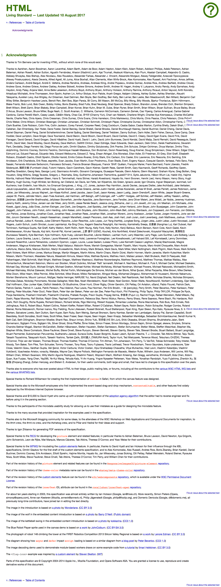
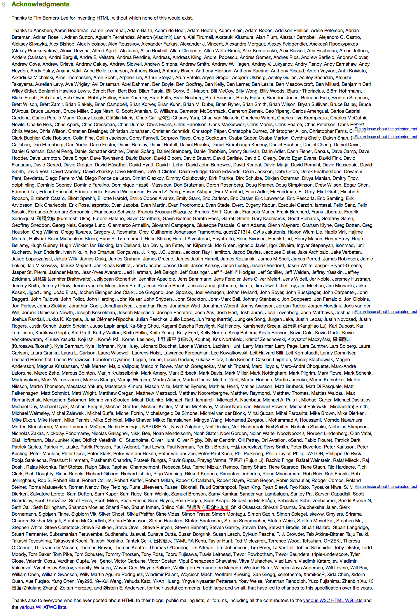

QCon上海演讲经验交流会分享
高桥流
简报法之心得

我

hax

贺师俊

github: @hax
zhihu: 贺师俊
weibo: @johnhax

百姓网
www.baixing.com

分类广告

分类~~广告~~

分类信息

1. 58同城,
1. 赶集,
1. 百姓网

1. 58集团,
1. 百姓网

百姓网
架构部

架构师

PPT架构师

PPT架构图

叠床架屋

风格华丽

~~架构师~~

程序员

程序员PPT

Coding

绝不BB

毫无修饰

我是程序员

Web前端程序员

Web
前端

Web
标准

HTML

HTML spec
[Acknowledgments](https://html.spec.whatwg.org/multipage/acknowledgements.html)

做了
一点微小的
工作

JavaScript

ECMAScript

Proposals

`..<`

`1 ..< 5`,
`1, 2, 3, 4`

Groovy,
Swift

[Exclusive range](https://github.com/hax/hax.github.com/issues/25)

JS

人呐…
自己就不可以预料

技术活动

10+场/年

分享

QCon

QConBeijing 2011

老朋友

分享

主持人

出品人

QConShanghai
2015, 2016 前端

优秀出品人

QConShanghai
2017 编程语言

QCon上海演讲经验交流会

谈谈试讲

高桥流简报法之心得

简报

Slides

幻灯片

PPT

Keynote

演示文稿

简报

高桥流

高桥征义

案例

案例0

`this`

案例1

正宗

[简报](https://www.slideshare.net/takahashim/diligent-people-lightweight-people)
[视频](https://www.youtube.com/watch?v=Vor6Yul7CMg)

案例2

人肉高桥流

“人生的忠告”

案例3

书

[《高桥流简报》](https://book.douban.com/subject/4326862/)

[一分三十四秒 就能看完的书](https://www.youtube.com/watch?v=8ni1MN4MYVI)

特点

字大
如斗

惜字
如金

无
修饰

不
斗图

页数
多

翻页
快

流

优点

大气

朴素

抓眼球

后排
也看得清

同步

无工具依赖

记事本

丰俭由人

临时抱佛脚

思考内容

连贯性

……

缺点

简陋

缺乏全景

光看PPT
可能get不到

……

非常适合
程序员

扩展

图

尽量简单

代码

尽量简短

拆分

高桥流
精髓

内容为王

控制单页
信息密度

流

线性

脑图

The End

QA

彩蛋

EVA 模式

白
