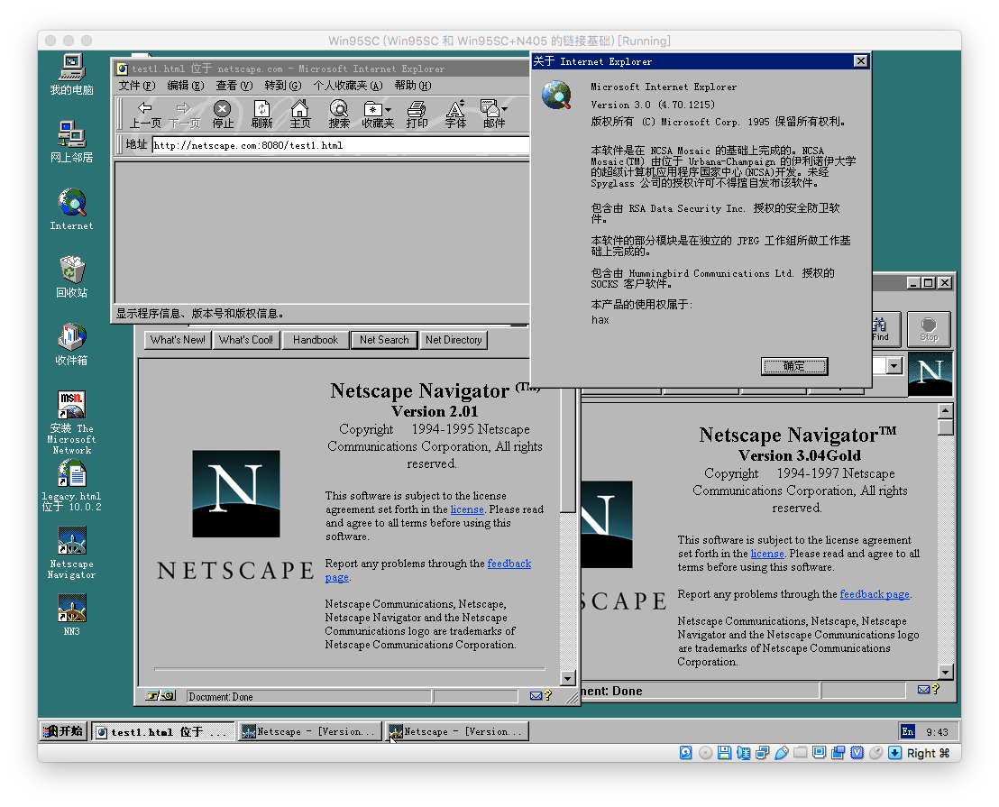

On the Origin of JS
探索原始JS

关于我

Web前端

20年
<!-- 早于有「Web前端」 -->

- 盛大创新院
- 百姓网
- 360奇舞团

2019年7月起
TC39代表
<!-- TC39：JS语言标准委员会 -->
<!-- 中国公司、中国JS社区第一批TC39代表之一 -->

- 3次QCon出品人
- 8次QCon讲师

GitHub @hax
知乎 @贺师俊
微博 @johnhax
Twitter @haxy
Freenode @haxjs

On the Origin of JS
探索原始JS

「考古」
<!-- 200年 => 20年，比真考古小至少一个数量级 -->

JavaScript
编程语言
之「考古」

缺少「历史文献」

ES3 1999
ES1 1997

1997年之前？
<!-- 文档过于简陋 -->

Brendan Eich
在10天内创造了JS

《创世纪》？
<!-- In the beginning Eich created `objects` and `functions` -->
<!-- And Eich said, "Let there be `this`" and there was `this` -->
<!-- Eich saw that `eval` was good... -->

传说时代

将传说时代还原到真实历史
就得靠「考古」

无用
<!-- QCon讲新技术的实践落地 -->

无用之用？

- [《是什么原因导致了 JS 中的 this 指向问题？》](https://www.zhihu.com/question/412637481)
- [《对于JavaScript的new Object()的疑问？》](https://www.zhihu.com/question/285068799)

What?
是什么？

Why?
为什么？

追根溯源
刨根问底

回答这些问题
有什么意义？

有趣！

JSConf EU 2017
[What's new in Netscape Navigator 2.0](https://www.youtube.com/watch?v=Z-nXRZkge2U)
by Marcin Szczepanski

[TodoMVC in NN2](https://youtu.be/Z-nXRZkge2U?t=391)

个人角度：技术好奇心

宏观角度：技术进步

拿来主义

站在巨人
的肩膀上

搭便车

~~搭便车~~

- 已经长大了，一般高了
- 领头羊想把你踢出赛道

从头搞起
<!-- 把所有坑都踩一遍 -->
<!-- 一步落后步步落后 -->

~~从头搞起~~

从头推演

编程语言

- 无形的基础设施
- 切换成本高
- 与业务关系低
- 历史制约很多
<!-- 但是很大程度上不是由公司投资的 -->
<!-- 代码作为核心资产却依赖于语言 -->

从头搞性价比很低
完全不搞是不行的

更需要汲取历史经验

JavaScript 的历史经验

- 最重要最流行的3种编程语言之一
- 最广泛使用的应用编程语言
- 混合多范式
- 动态语言，但有静态类型的变种,
- 起点非常传奇

我个人使用JS的历史经验,
上溯到1998年

IE 4

JS 1.0 / Netscape 2 @ 1996年3月
JS 1.1 / Netscape 3 @ 1996年8月
JS 1.2 / Netscape 4 @ 1997年6月
JScript 1.0 / IE 3 @ 1996年8月
JScript 3.0 / IE 4 @ 1997年10月

- 用过 NN2 的人？
- 为 NN3 写过代码的人？
- 研究过 JS 1.0 / JS 1.1 的人？
<!-- 周爱民, B站 前端会客厅 -->

原始JS仍然是个没有
多少人探索过的领域

[JavaScript: The First 20 Years](http://www.wirfs-brock.com/allen/posts/866)

Allen Wirfs-Brock
Brendan Eich

HOPL-IV (The History of Programming Languages Conferences)
第四届「编程语言历史」大会

- HOPL1 1978 (BASIC, COBOL, FORTRAN, LISP ...)
- HOPL2 1993 (C, C++, Pascal, Prolog, Smalltalk ...)
- HOPL3 2007 (AppleScript, Erlang, Haskell, Lua ...)
<li>HOPL4 2020 (Clojure, D, F#, Groovy, JavaScript,  Hygienic macro, MATLAB, Objective-C, R, SML ...)</li>

[《JavaScript20年史》](https://github.com/doodlewind/jshistory-cn)

[The Origins of JavaScript](https://github.com/doodlewind/jshistory-cn/blob/master/part-1.md)

指导文献有了
细节仍需考古

准备工作
（考古现场）

- Virtualbox 虚拟机
- Windows 95
- Netscape Navigator 2.0 beta 2
- Netscape Navigator 2.01
- Netscape Navigator 3
- Internet Explorer 3

一些困难

- 搞到老的浏览器binary安装包
- Netscape可能有平台差异
- NN2 beta 2 有时间限制
- NN2 不支持外部脚本
- 没有 console.log
- 没有 typeof、全等 等基本运算符
- 没有 try ... catch
- NN2 很容易崩溃

Demo

一些针对「原始JS」
的「惊人」发现

没有闭包！

没有`prototype`！

`arguments`是函数！

函数之外没有`this`！

默认`this`可能是函数自己！

可以魔改调用栈！

`eval()`

回答前面的问题

是什么原因导致了 JS 中的 this 指向问题？

- 最初设计并没有 global this
- 表现为 global this 是因为最初所有自定义函数都是 global 函数
- 由最初行为推导的原初设计可能是……

BE当初一个可能的设计目标/结果

具有超级reflection
和超级动态化的运行时

谁改变了路径？

一个有着更丰富
编程语言和工具
经验的参与者

微软

「静态化」和「动态化」的张力

早熟

总结
