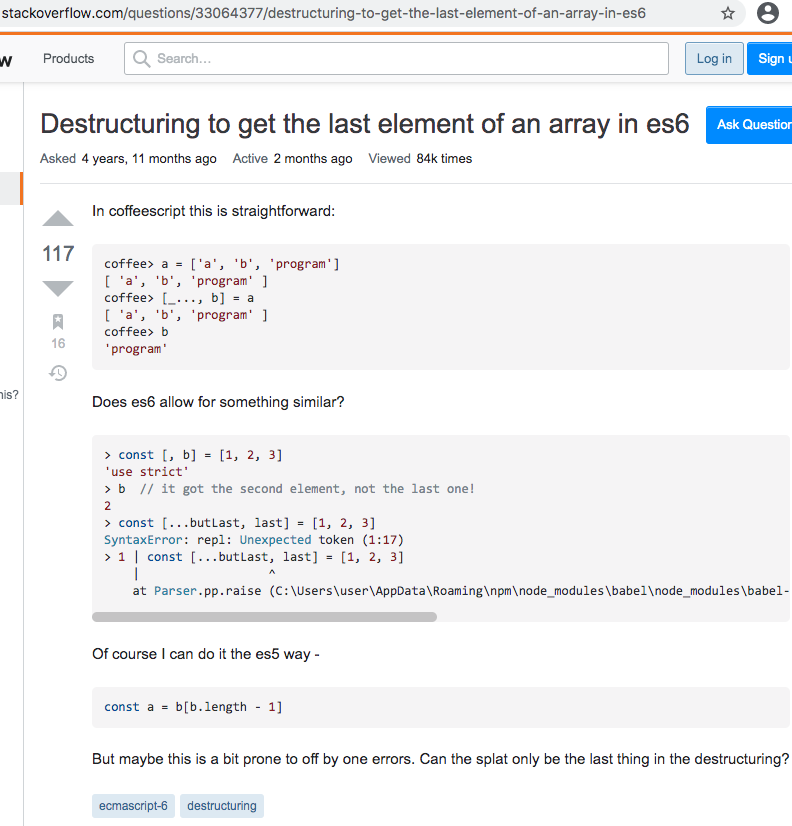
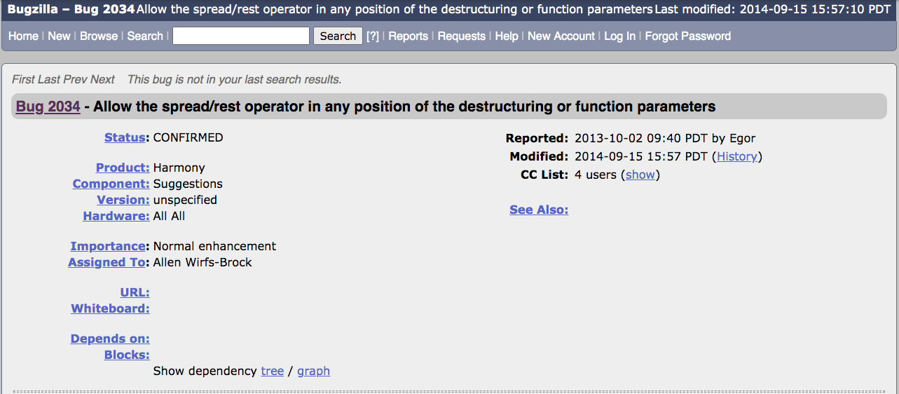

Double-ended Iterator and
Destructuring for Stage 1
--------------------------------------------------------
<div>贺师俊 @hax <small>Sept 2020 TC39</small></div>

Motivation

```js
let [first, second, ...rest] = iterable
\
// Can we take items from back?
let [...rest, last] = iterable
let [first, ...rest, last] = iterable
```



- 2015 https://stackoverflow.com/questions/33064377/destructuring-to-get-the-last-element-of-an-array-in-es6
- 2017 https://stackoverflow.com/questions/44309181/javascript-es6-split-array-into-rest-and-last-with-destructuring
- 2017 https://stackoverflow.com/questions/44527643/get-first-and-last-elements-in-array-es6-way
- 2018 https://stackoverflow.com/questions/52363733/making-rest-item-first-while-assigning-value-by-array-destructuring
- 2019 https://stackoverflow.com/questions/54246599/how-to-use-destructuring-on-an-array-with-an-offset-number
- 2019 https://stackoverflow.com/questions/58569356/how-can-i-get-last-element-of-an-array-by-using-destructuring
<hr></hr>
- 2011 https://esdiscuss.org/topic/early-spread-operator
- 2011 https://esdiscuss.org/topic/parameter-lists-as-arguments-destructuring-sugar#content-3
- 2012 https://esdiscuss.org/topic/rest-parameter-syntax
- 2014 https://esdiscuss.org/topic/rest-parameter-anywhere
- 2015 https://esdiscuss.org/topic/rest-parameters
- 2017 https://esdiscuss.org/topic/strawman-complete-array-and-object-destructuring
- 2017 https://esdiscuss.org/topic/an-update-on-rest-operator

```py
(first, *rest, last) = [1, 2, 3, 4] // Python, Ruby
```
```coffee
[first, rest..., last] = [1, 2, 3, 4] // CoffeeScript
```
```rust
[first, rest @ .., last] = [1, 2, 3, 4] // Rust
```


http://web.archive.org/web/20141214094119/https://bugs.ecmascript.org/show_bug.cgi?id=2034

It's time to add it!

Use cases

```js
let [...rest, last] = iterable
let [first, ...rest, last] = iterable
```
```js
let [first, ..., last] = document.querySelectorAll('.note')
last.appendChild(createLinkTo(first))
```

```js
// https://github.com/tc39/proposal-array-last/issues/31 by @jridgewell
string.replace(pattern, (fullMatch, ...submatches, matchIndex, fullString) => {
  // `matchIndex` is always the second to last param (the full string is the last param).
  // There may be many submatch params, depending on the pattern.
})
```

```js
db.run(
	"SELECT * FROM table WHERE foo=? AND cbar=?", "bar", "cfoo",
	(err, row) => { ... }
)
```
```js
function run(query, ...params, callback) {
	...
}
```

Semantic?

```js
let [first, ...rest, last] = iterable
// ->
let [first, ...rest] = iterable
let last = rest.pop()
```

Need to save all items
in the `rest` array

```js
let [first, ..., last] = iterable // omit rest
// ->
let first, last
const it = Iterator.from(iterable)
let r = it.next()
if (!r.done) {
	first = r.value
	for (;;) {
		r = it.next()
		if (r.done) {
			last = r.value
			break
		}
	}
}
```

Still need to consume
the entire iterator

```js
const [..., last] = aVeryLargeArray
```
```js
const [..., last] = range(1, 100000)
```
```js
const [..., last] = repeat(value)
```

Double-ended Iterator:
An iterator able to yield
elements from both ends

```rust
// https://doc.rust-lang.org/std/iter/trait.DoubleEndedIterator.html
\
let numbers = vec![1, 2, 3, 4, 5, 6];
\
let mut iter = numbers.iter();
\
assert_eq!(Some(&1), iter.next());
assert_eq!(Some(&6), iter.next_back());
assert_eq!(Some(&5), iter.next_back());
assert_eq!(Some(&2), iter.next());
assert_eq!(Some(&3), iter.next());
assert_eq!(Some(&4), iter.next());
assert_eq!(None, iter.next());
assert_eq!(None, iter.next_back());
```

```js
// JS array is just a deque (double-ended queue)
const iter = Iterator.from([1, 2, 3, 4, 5, 6])
iter.next() // {value: 1}
iter.nextBack() // {value: 6}
iter.nextBack() // {value: 5}
iter.next() // {value: 2}
iter.next() // {value: 3}
iter.next() // {value: 4}
iter.next() // {done: true}
iter.nextBack() // {done: true}
```

Question:

How to implement
double-ended iterator
using generator?

```js
Array.prototype.values = function *values() {
	let i = 0
	while (i < this.length) {
		yield this[i++]
	}
}
```


```js
Array.prototype.values = function *values() {
	let front = 0, back = 0
	while (front + back < this.length)
		if (__FROM__ === 'back') yield this[this.length - (++back)]
		else yield arr[front++]
	}
}
```

```js
Array.prototype.values = function *values() {
	let front = 0, back = 0
	while (front + back < this.length)
		if (function.sent === 'back') yield this[this.length - (++back)]
		else yield arr[front++]
	}
}
```

```js
const iter = Iterator.from([1, 2, 3, 4, 5, 6])
iter.next() // {value: 1}
iter.nextBack() // {value: 6}
iter.nextBack() // {value: 5}
iter.next() // {value: 2}
iter.next() // {value: 3}
iter.next() // {value: 4}
iter.next() // {done: true}
iter.nextBack() // {done: true}```
```

```js
const iter = Iterator.from([1, 2, 3, 4, 5, 6])
iter.next() // {value: 1}
iter.next('back') // {value: 6}
iter.next('back') // {value: 5}
iter.next() // {value: 2}
iter.next() // {value: 3}
iter.next() // {value: 4}
iter.next() // {done: true}
iter.next('back') // {done: true}```
```

```js
let [first, ..., last] = iterable
// -> (roughly)
let iter = Iterator.from(iterable)
let first = iter.next().value
let last = iter.next('back').value
iter.return()
```

Iterator helpers

```js
Iterator.prototype.map = function *map(mapper) {
	for (;;) {
		const {done, value} = this.next(function.sent)
		if (done) return
		yield mapper(value)
	}
}
let [a, ..., b] = Iterator.from([1, 2, 3]).map(x => x * 2)
a // 2
b // 6
```

```js
Iterator.prototype.reversed = function *reversed() {
  for (;;) {
    let result
    if (function.sent === 'back') result = this.next()
    else result = this.next('back')
    if (result.done) return
    else yield result.value
  }
}
```

Issues:
- [Destructuring edge cases](https://github.com/hax/proposal-deiter/blob/main/destructuring.md)
- [#5 How to mark double-ended iterator](https://github.com/hax/proposal-deiter/issues/5)
- [#4 How to specify this in the built-in iterators?](https://github.com/hax/proposal-deiter/issues/4)

Discussion...

Advance to Stage 1?

Thank you!
[This slide: https://johnhax.net/2020/tc39-sept-deiter](https://johnhax.net/2020/tc39-sept-deiter)
[Proposal repo: https://github.com/hax/proposal-deiter](https://github.com/hax/proposal-deiter)
