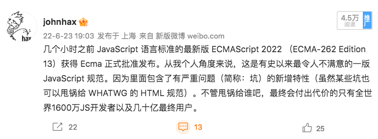

ES2022 — JS is dead
long live ecosystem
--------------------------------
贺师俊 @ GIAC 2022-11-18

知乎 贺师俊
微博 @johnhax
GitHub @hax

关于我

Web前端和JS语言
20多年发展历程
见证人和参与者

2019年6月~2021年4月
360集团 TC39代表
2021年4月起 特邀专家

TC39：JS语言标准委员会
ES3 -> ES5 -> ES6 (ES2015)
自2015年起每年6月发布ES20XX



ES2022
[Finished proposals](https://github.com/tc39/proposals/blob/main/finished-proposals.md)

- ES2022 之 class 一坨
- ES2022 之 Top-level `await`
- ES2023 之 Hashbang `#!`
- ES2022 之 `.at()`、`.hasOwn()`、`/pattern/d` 和 `.indices`
- ES2023 之 `Array.prototype.findLast()`/`findLastIndex()`
- ES2022 之 Error cause

1. ES2022 之 class 一坨
0. ES2022 之 Top-level `await`
0. ES2023 之 Hashbang `#!`
0. ES2022 之 `.at()`、`.hasOwn()`、`/pattern/d` 和 `.indices`
0. ES2023 之 `Array.prototype.findLast()`/`findLastIndex()`
0. ES2022 之 Error cause

Error cause (ES2022)
吴成忠（@legendecas），阿里巴巴

识别问题

```js
async function doJob() {
  const rawResource = await fetch('//domain/resource-a')
    .catch(err => {
      // How to wrap the error properly?
      // 1. throw new Error('Download raw resource failed: ' + err.message);
      // 2. const wrapErr = new Error('Download raw resource failed');
      //    wrapErr.cause = err;
      //    throw wrapErr;
      // 3. class CustomError extends Error {
      //      constructor(msg, cause) {
      //        super(msg);
      //        this.cause = cause;
      //      }
      //    }
      //    throw new CustomError('Download raw resource failed', err);
    })
  const jobResult = doComputationalHeavyJob(rawResource);
  await fetch('//domain/upload', { method: 'POST', body: jobResult });
}
await doJob(); // => TypeError: Failed to fetch
```

- 不直接暴露低层操作的错误
- 链式错误模式：每个层次的错误提供合适的上下文信息并包装更低层的错误
- 目前不是做不到，但是很麻烦
- 缺乏标准的做法，导致日志和调试工具无法提供帮助

解决方案

```js
async function doJob() {
  const rawResource = await fetch('//domain/resource-a')
    .catch(err => {
      throw new Error('Download raw resource failed', { cause: err });
    });
  const jobResult = doComputationalHeavyJob(rawResource);
  await fetch('//domain/upload', { method: 'POST', body: jobResult })
    .catch(err => {
      throw new Error('Upload job result failed', { cause: err });
    });
}
try {
  await doJob();
} catch (e) {
  console.log(e);
  console.log('Caused by', e.cause);
}
// Error: Upload job result failed
// Caused by TypeError: Failed to fetch
```

```js
new Error(message, cause) // ❌
new Error(message, {cause}) // ✅
```

- 向前兼容性
- 向后兼容性（可扩展性）

```js
// Firefox
new Error(message, filename?, lineNumber?)
// DOM API
new DOMException(message, 'NotSupportedError')
```

```js
new DOMException(message, 'NotSupportedError')
new DOMException(message, {name: 'NotSupportedError'})
new DOMException(message, {name: 'NotSupportedError', cause})
```

```js
// 未来可能的其他特性
new Error('assertion failed', {name: 'AssertionError'})
new Error('assertion failed', {fatal: true})
```

```js
// 缺点
try {
	...
} catch (e) {
	throw new Error(message, e) // 写错了
	// throw new Error(message, {cause: e})
	// 简单的类型检查并不能发现这个错误
	// 因为e如果是Error，则具有cause属性，
	// 和 {cause: any} 类型是相容的
	// 普适解决方法：对option bag强制object literal
	// ad-hoc解决方法：lint规则对第二个参数排除Error
}
```

```js
// 特殊性
'cause' in Error.prototype // false
Object.hasOwn(new Error('', {}), 'cause') // false
Object.hasOwn(new Error('', {cause: undefined}), 'cause') // true
// 对比
'message' in Error.prototype // true
Object.hasOwn(new Error(), 'message') // false
Object.hasOwn(new Error(undefined), 'message') // false
Object.hasOwn(new Error(''), 'message') // true
// 对比
class Test { x; constructor(x) { this.x = x } }
'x' in Test.prototype // false
Object.hasOwn(new Test(), 'x') // true
```

```js
try {
	...
} catch (e) { // 理论上 e 可能是 undefined
	throw new Error('fail', {cause: e})
}
// 处理 cause
if ('cause' in e) { ... }
```

个人评价：很有价值
有些小问题但工程上容易解决或无伤大雅

`findLast`/`findLastIndex` (ES2023)
王文璐（@Kingwl），前微软中国

识别问题

```js
const array = [{ value: 1 }, { value: 2 }, { value: 3 }, { value: 4 }];
array.find(n => n.value % 2 === 1); // { value: 1 }
array.findIndex(n => n.value % 2 === 1); // 0
// find
[...array].reverse().find(n => n.value % 2 === 1); // { value: 3 }
// findIndex
array.length - 1 - [...array].reverse().findIndex(n => n.value % 2 === 1); // 2
array.length - 1 - [...array].reverse().findIndex(n => n.value === 42); // should be -1, but 4
```

解决方案

```js
// find
array.findLast(n => n.value % 2 === 1); // { value: 3 }
// findIndex
array.findLastIndex(n => n.value % 2 === 1); // 2
array.findLastIndex(n => n.value === 42); // -1
```

动机和场景（灵魂之问）
为什么用库不行？

- `padStart`/`padEnd`/`trimStart`/`trimEnd`
- Performance
- 库被引用的频繁程度
- API的完整性

- lodash.findlast 30k+/w
- lodash.findlastindex 10k+/w
- lodash.nth 1k+/w

计科两大难
命名与缓存

- findRight/findIndexRight
- findEnd/findIndexEnd
- findLast/findIndexLast
- findLast/findLastIndex

- `***Right`: `reduce`/`reduceRight`, `trimLeft`/`trimRight`
- `***End`: `padStart`/`padEnd`, `trimStart`/`trimEnd`
- `***Last`: `lastIndexOf`

个人评价：较有价值，且没有缺点

RegExp Match Indices (ES2022)
`/pattern/d` 和 `.indices`
Ron Buckton，微软

识别问题

```js
let techConfs = `
- GIAC
	date: 2022-11-18
	city: 上海
- IDEA
	date: 2022-11-22
	city: 深圳
`
for (let m of techConfs.matchAll(/date:\s*(.+)/g)) {
	console.log(m)
}
// ['date: 2022-11-18', '2022-11-18', index: 9, ...]
// ['date: 2022-11-22', '2022-11-22', index: 44, ...]
// 无法得到捕获组的索引位置
```

解决方案

```js
for (let m of techConfs.matchAll(/date:\s*(.+)/gd)) {
	console.log(m)
}
// ['date: 2022-11-18', '2022-11-18', index: 9,
// indices: [[9, 25], [15, 25]],
// ...]
// ['date: 2022-11-22', '2022-11-22', index: 44,
// indices: [[44, 60], [50, 60]],
// ...]
```

为什么要额外的`d`？,
因为性能,
`d`的含义？,
inDices

个人评价：有价值
但用例较少，性价比不高
正则本身就有过度复杂和滥用问题

`Object.hasOwn()` (ES2022)
Jamie Kyle, Rome (Author)
Tierney Cyren, Microsoft

识别问题

```js
let o = { hasOwnProperty: "hehe" }
o.hasOwnProperty("foo")
Object.create(null).hasOwnProperty("foo")
// Uncaught TypeError: hasOwnProperty is not a function
\
// 健壮但繁琐的写法
let hasOwnProperty = Object.prototype.hasOwnProperty
if (hasOwnProperty.call(o, "foo")) {
  console.log("has property foo")
}
// 或者
if (Object.getOwnPropertyDescriptor(o, "foo")) {
	console.log("has property foo")
}
```

解决方案

```js
if (Object.hasOwn(o, "foo")) {
  console.log("has property foo")
}
```

为什么不是`Object.hasOwnProperty`？,
因为`Object.hasOwnProperty()`已经有了
比如`Object.hasOwnProperty("hasOwn")`得到`true`,
为什么不是`Object.has`？,
因为语义不够清晰，且和`Object.keys`无法完全对应

个人评价：聊胜于无

`.at()` (ES2022)
Tab Atkins, Shu-yu Guo, Google

识别问题

```js
let last = array[array.length - 1]
```

解决方案

```js
let last = array.at(-1)
```

个人评价：鸡肋

- lodash.findlast 30k+/w
- lodash.findlastindex 10k+/w
- lodash.nth 1k+/w (`.at()`)

```js
++array[array.length - 1]
array[array.length - 1] = array.at(-1) + 1 // 黑人问号
```


玩笑归玩笑，玩笑背后的真正问题：
`arr.at(i)`方法和`arr[i]`
在处理非索引时语义不同

看似简单，但：

- 字符串是不是有at()方法？
- `arguments`是不是有at()方法？
- `document.body.classList`上是不是有at()方法？

和老的 `String.prototype.at` 提案
语义不同，不能处理代理对字符

`a.at(-idx)` 当`idx`是计算值的时候，
若该值正好为边界值 `0`，到底程序员意图是什么？
- `a.at(a.length - 0)`
- `a.at(0)`

负数索引本身是有坑的
（尽管现有的方法如`slice`已经如此）

```js
let a = [1,2,3]
let i = a.findIndex(x => x > 3)
a[i] // undefined
a.at(i) // 1 !
```

- 个人评价：鸡肋
- 个人建议：避免使用
- 替代方案：`a[^i]`提案

为啥当初不反对这个提案？
因为当初这个提案原名`item()`
有额外的motivation：统一DOM已有的方法
后来因为兼容性问题必须改名就只剩鸡肋

Hashbang `#!` (ES2023)
Bradley Farias, Node.js

识别问题

```js
#!/usr/bin/env node
console.log(1);
```

解决方案

```js
#!/usr/bin/env node
console.log(1);
```

个人评价：有潜在风险

```js
#!/usr/bin/env node
if (typeof window === 'object') {
	console.log('browser env')
} else {
	console.log('node env')
}
```
```sh
$ ./test.js          　
```
```html
<script src=test.js>
</script>
```

`hashbang`原本只用于node入口脚本
当进入标准之后可能被滥用于同构脚本

```js
#!/usr/bin/env node
if (isNodeEnv()) {
	openBrowser(htmlFileFor(__filename))
} else {
	// normal code for browser env
	// ...
}
```
```js
#!/usr/bin/env node
if (!isNodeEnv()) initNodeEmulator()
// normal code for node env
// ...
```

```html
<script src=test.js>
</script>
```
```html
<script>
<?php include 'test.js' ?>
</script>
```
,
Oops, syntax error!

```html
<script>#!/usr/bin/env node
console.log('ok')
</script>
```
```html
<!-- Oops, syntax error! -->
<script>
#!/usr/bin/env node
console.log('ok')
</script>
```

无意的空白造成 Syntax Error

[Why only at the start of a Source Text](https://github.com/tc39/proposal-hashbang#why-only-at-the-start-of-a-source-text)
> There is no gain for the intended usage by allowing it in other places and in fact
> could lead to confusion since it would not be picked up by CLI environments.

JS scripts in browsers may be
transformed in various ways

Programmers always have a simple belief:
Prepend/Append whitespaces/comments
will not change the behavior of my code,
(This is true from ES1 to ES2021, until hashbang proposal)

Simple transformations which normally do not use full-featured parser
- Adding copyrights and license at start
- Providing server information for debugging by prepending comments
- Function wrapping (eg. convert CommonJS to AMD/UMD)
- Simple concat of source files
- Not intentionally, but for a variety of reasons adding the newline/whitespace accidently

Stakeholders in production (ordered by timeline)
- Transformers authors (who never expect whitespaces/comments could cause syntax error)
- Operations team
- Script users
- Script authors (who may add hashbang in the future minor verions)

Not immediate problems
But protential risks

Proposed Solution:
Relax hashbang syntax
(make `#!` behave like `//` or `-->`)

Precedents
- BOM (treat BOM as whitespace)
- HTML comments

Alternative Solutions:
Make hashbang support optional (Let browsers do not support it)
So developers will keep only using hashbang in cli-only scripts

- 个人评价：有潜在风险
- 个人建议：通过lint工具禁用
- 替代方案：node/deno等的入口脚本用不同的文件后缀名（或用白名单）

Top-level `await` (ES2022)
Myles Borins, Google
Yulia Startsev, Mozilla
Daniel Ehrenberg, Guy Bedford, Ms2ger, and others.

识别问题

```js
// awaiting.mjs
import { process } from "./some-module.mjs";
let output;
(async () => {
  const dynamic = await import(computedModuleSpecifier);
  const data = await fetch(url);
  output = process(dynamic.default, data);
})();
export { output };
// usage.mjs
import { output } from "./awaiting.mjs";
export function outputPlusValue(value) { return output + value; }
console.log(outputPlusValue(100));
setTimeout(() => console.log(outputPlusValue(100), 1000);
```

解决方案

```js
// awaiting.mjs
import { process } from "./some-module.mjs";
const dynamic = import(computedModuleSpecifier);
const data = fetch(url);
export const output = process((await dynamic).default, await data);
// usage.mjs
import { output } from "./awaiting.mjs";
export function outputPlusValue(value) { return output + value }
console.log(outputPlusValue(100));
```

个人评价：对Node项目还好，对Web项目有大坑

```html
<!doctype html>
<head>
<script type=module>
addEventListener('load', () => {
  doSth()
})
// ...
import 'foo'
</script>
```

```html
<!doctype html>
<head>
<script type=module>
localStorage.data = {x: 42}
// ...
import 'foo'
</script>
<script type=module>
doSth(JSON.parse(localStorage.data))
</script>
```

Top-level `await`
为什么有坑？

- TLA隐式传递，所有依赖TLA的模块都变成异步模块
- TLA确实好用，但可见性很差，以至于很容易无意间引入TLA
- 任何深层依赖的TLA都可以阻塞整个应用
- 无意间引入的TLA可以改变代码的执行序
- 原本合理的重构（无论手动还是自动）可能由于TLA而违反预期

解决方案？

- 教育
- 工具

- 我能教育多少人？
- 教了你你就能避免踩坑吗？
- 教了你你就能避免别人挖坑吗？
- 心智负担：怎么判断这里用TLA是否合理

- 不用TLA检查工具的程序员不是好运维
- 适用所有场景吗？
- 心智负担和背锅负担：怎么判断是否允许TLA
- 心智负担和背锅负担：怎么判断TLA是否会引发问题

从入门到被坑

还没完

Service worker 的故事

- 禁用TLA，除非用动态import导入
- Reasonable（性能！）
- 开创了『那里能用，这里不能用』的先河

可能的解决方案
将Service worker的方案推而广之

- 普通modulescript不允许TLA（但可用动态import）
- async的modulescript允许TLA

```html
<script type=module async></script>
```

- 教育
- 工具

教育：await只能用于async上下文
async functions、async generators、
async module、async script（未来？）
工具：不需要额外工具，直接浏览器里一跑便知

问题

- champions 不同意（理由不明）
- 不是 TC39 的范畴，而是 WHATWG/W3C 的领地

- 个人评价：对Web项目是大坑
- 个人建议：库代码中严格禁用，应用代码中暂时禁用（但目前没有办法禁用~）
- 替代方案：未来lint和打包工具确保只有`<script type=module async>`可以使用

Class fields等
- public instance fields
- private instance fields
- private instance methods and accessors
- static ...
- ergonomic brand checks for private elements
- class static block（除外）

- 个人评价：Considered harmful
- 个人建议：自求多福
- 替代方案：没有（TS在部分问题上有一些保护，但效果有限）

总结

1. ES2022 之 class 一坨：很糟糕，工程上无法控制风险
0. ES2022 之 Top-level `await`：Web项目有较严重的工程风险
0. ES2023 之 Hashbang `#!`：潜在生态风险
0. ES2022 之 `.at()`、`.hasOwn()`、`/pattern/d` 和 `.indices`：鸡肋、聊胜于无、还行
0. ES2023 之 `Array.prototype.findLast()`/`findLastIndex()`：不错
0. ES2022 之 Error cause：很有价值，瑕不掩瑜

为什么会这样？

JS 技术复杂度
历史包袱和兼容性要求
不同平台的需求冲突
不同标准组织的分工
一些特殊限制（如membrane）
委员会机制和流程
公司关系和人际关系
引擎厂商之间的矛盾
代表的个人偏好和倾向性

老一代领袖退出
浏览器厂商话语权过大
缺乏开发者代表
部分代表有严重个人偏好
优先满足委员会内部

提升中国参与标准化需要
个人、公司、标准化组织
不断共同努力

[中国计算机学会TF43 简报](https://johnhax.net/2021/js-cn/slide#72)
[中国计算机学会TF43 录像](https://dl.ccf.org.cn/video/videoDetail.html?_ack=1&id=5578915538241536)

ES2022 — JS is dead
long live ecosystem

- 新语言特性的边际效用下降
- 好做的早做完了，剩下的都是困难的、利弊互现的东西
- 后续还有多个争议性提案

JS is dead 不是说真的死了
而是JS语言进入了发展瓶颈期
且未来路径的不确定性风险很高

- 无论 JS 语言有多大的问题，JS 的生态会一直发展壮大
- 足够大的生态会孕育工具和方案来逐渐解决问题
- 可能是时候考虑在现有 JS/TS 生态中孕育新的语言了

QA

Thank you
