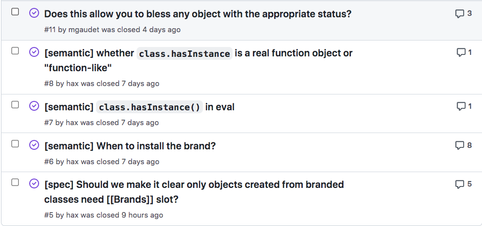

Class brand check for Stage 1
--------------------------------------------------------
<div><ruby>贺师俊<rp>（</rp><rt>HE Shi-Jun</rt><rp>）</rp></ruby> @hax <small>Jan 2021 TC39</small></div>

Class brand check for Stage 2
--------------------------------------------------------
<div><ruby>贺师俊<rp>（</rp><rt>HE Shi-Jun</rt><rp>）</rp></ruby> @hax <small>Jan 2022 TC39</small></div>

- [This slide: johnhax.net/2022/class-brand](https://johnhax.net/2022/class-brand/slide)
- [Proposal repo: tc39/proposal-class-brand-check](https://github.com/tc39/proposal-class-brand-check)
- [Spec text: tc39.es/proposal-class-brand-check](https://tc39.es/proposal-class-brand-check/)
- [Presentation scripts: ~/docs/stage2.md](https://tc39.es/proposal-class-brand-check/docs/stage2)

Advanced to Stage 1 at Jan 2021
Three champions now:
<ul>
<li><ruby>贺师俊<rp>（</rp><rt>HE Shi-Jun</rt><rp>）</rp></ruby> @hax</li>
<li><ruby>徐田洋<rp>（</rp><rt>XU Tian-Yang</rt><rp>）</rp></ruby> @XGHeaven</li>
<li><ruby>涂　强<rp>（</rp><rt>TU Qiang</rt><rp>）</rp></ruby> @YuriTu</li>
</ul>

Two transpiler implementation:
- Babel #13959 by @YuriTu
- TS #46578 by @Jack-Works



```js
class Range {
  start
  end
  constructor(start, end) {
    this.start = start|0
    this.end = end|0
    Object.freeze(this)
  }
  *[Symbol.iterator]() {
    for (let i = this.start; i < this.end; ++i) yield i
  }
  equals(that) {
    if (!class.hasInstance(that)) return false
    return this.start === that.start && this.end === that.end
  }
}
```

```js
class Range {
  // ...
  equals(that) {
    if (!class.hasInstance(that)) return false
    return this.start === that.start && this.end === that.end
  }
}
```

Motivation

- `instanceof`: prototype based, no guarantee
- `WeakSet`: boilerplate, infamiliar API, GC? Perf?
- `try { o.#priv; true } catch { false }`: Abusing field
- `#priv in o`: good for per-field existence check, but...

`class.hasInstance(o)` VS. `#priv in o`

In Mental Models

- `class.hasInstance(o)`: whether `o` is an instance of the class
- `#priv in o`: whether `o` has a private element named `#priv`,
- Reflect the general hasInstance/instanceof concept of OOP
- Reflect “brand” directly with code-level private element name,
- “Brand” may be not a good term for average programmers

```js
function Return(it) { return it }
class Feature extends Return {
	#data
	static process(o) {
		if (#data in o) {
			// do something using o.#data
		} else {
			// do something else
			new Feature(o)
		}
		update(o.#data)
	}
}
```

Duck type check
- `key in o`
- `#priv in o`

Duck type check
Interface query ✅
Concrete class check ❓

`instanceof`
Cross-realm ❌
Duck type check
Cross-realm ✅

Duck type check ⬌ Cross-realm ✅

`"key" in o` 🦆 ⬌ Cross-realm ✅
`#priv in o` 🦢 ⬌ Cross-realm ❌

`o instanceof Clazz`
prototype-based, old school, no cross-realm
`class.hasInstance(o)`
class-based, modern ES2015+, no cross-realm

In Practice

```js
class Range {
  start
  end
  constructor(start, end) {
    this.start = start|0
    this.end = end|0
    Object.freeze(this)
  }
  *[Symbol.iterator]() {
    for (let i = this.start; i < this.end; ++i) yield i
  }
  equals(that) {
    if (!class.hasInstance(that)) return false
    return this.start === that.start && this.end === that.end
  }
}
```

```js
class Range {
  #start
  #end
  constructor(start, end) {
    this.#start = start|0
    this.#end = end|0
    Object.freeze(this)
  }
  *[Symbol.iterator]() {
    for (let i = this.#start; i < this.#end; ++i) yield i
  }
  equals(that) {
    if (!(#start in that && #end in that)) return false
    return this.#start === that.#start && this.#end === that.#end
  }
}
```

```js
class Range {
  #start
  #end
  get start() { return this.#start }
  get end() { return this.#end }
  constructor(start, end) {
    this.#start = start|0
    this.#end = end|0
    Object.freeze(this)
  }
  *[Symbol.iterator]() {
    for (let i = this.#start; i < this.#end; ++i) yield i
  }
  equals(that) {
    if (!class.hasInstance(that)) return false
    return this.#start === that.#start && this.#end === that.#end
  }
}
```

```js
class A {
  static latest
	constructor() {
		A.latest = this
	}
}
class B extends A {
	#x
	#y = mayError()
}
try { new B() } catch {}
A.latest // only have #x but no #y
```

```js
class Range {
  start
  end
  equals(that) {
    if (#brand in that) return false
    return this.start === that.start && this.end === that.end
  }
  // ...
  // DO NOT add class fields after this line!!!
  #brand // Only for branding purpose, don't touch it!
}
```

Old Stage 1 Slides

```js
// Ergonomic brand checks for Private Fields
class C {
	#brand
	static isC(obj) {
		return #brand in obj // private in
	}
}
```

```js
// Example in the README of private-in proposal
class C {
  #brand;
  #method() {}
  get #getter() {}
  static isC(obj) {
		// check all private names
    return #brand in obj && #method in obj && #getter in obj;
  }
}
```

Why we need `isC()`?

```js
class Range {
  #start
  #end
  constructor(start, end) {
    this.#start = start
    this.#end = end
  }
  includes(value) {
    return value >= this.#start && value < this.#end
  }
  equals(range) {
    return this.#start === range.#start && this.#end === range.#end
  }
}
```

```js
let r1 = new Range(1, 5)
let r2 = new Range(2, 5)
r1.equals(r1) // true
r1.equals(r2) // false
r1.equals({}) // expect false, actually throw TypeError
```


```js
class Range {
	...
  equals(range) {
    if (!(range instanceof Range)) return false
    return this.#start === range.#start && this.#end === range.#end
  }
}
```

```js
new Range(1, 5) instanceof Range // true
Object.create(Range.prototype) instanceof Range // also true
```

```js
class Range {
	...
  equals(range) {
    if (!(range instanceof Range)) return false
    return this.#start === range.#start && this.#end === range.#end
  }
}
```

```js
class Range {
	...
  equals(range) {
    if (!isRange(range)) return false
    return this.#start === range.#start && this.#end === range.#end
  }
}
```

```js
class Range {
	...
  equals(range) {
    if (!(range IsRealInstanceOf Range)) return false
    return this.#start === range.#start && this.#end === range.#end
  }
}
```

What is `isC` or "is real instance of `C`" mean?

`o` is the "real instance" of class `C`,
means `o` have all public interfaces and
internal implementation details of `C`

Note: `isC` or "is real instance of `C`"
is a concept model in the programmer's mind
shared by almost all mainstream OOP programming languages
based on the high-level intension
not based on the low-level mechnism

Our problem: `instanceof` is prototype-based by default,
currently we don't have the mechnism
which could 100% map that concept

```js
// Abusing the low-level mechnism (try/catch)
// to make up high-level intentions
class C {
  #x
  static isC(obj) {
    try { obj.#x; return true }
    catch { return false }
  }
}
```

```js
class C {
  get #x() { ... }
  static isC(obj) {
	  try { obj.#x; return true }
    catch { return false }
  }
}
```

```js
class C {
  get #x() { ... }
  static isC(obj) {
	  return #x in obj
  }
}
```

It seems to solve the problem
But still a mismatch between the
low-level mechanics and the high-level intention

```js
class Range {
  #start
  #end
  ...
  equals(range) {
    if (!(#start in range && #end in range)) return false
    return this.#start === range.#start && this.#end === range.#end
  }
}
```

```js
class Range {
  start
  end
  ...
  equals(range) {
    if (!(???)) return false
    return this.start === range.start && this.end === range.end
  }
}
```

```js
class Range {
  #start
  #end
  get start() { return this.#start }
  get end() { return this.#end }
  set start(value) { this.#start = value }
  set end(value) { this.#end = value }
  ...
  equals(range) {
    if (!(#start in range && #end in range)) return false
    return this.#start === range.#start && this.#end === range.#end
  }
}
```

be tempted to use private field，
even you don't need it

Affect semantics (breaking change)
- `Object.keys()`/`assign()` behavior
- proxy transparency

Even you already
use private fields

```js
class C {
  #brand;
  #method() {}
  get #getter() {}
\
  static isC(obj) {
    return #brand in obj && #method in obj && #getter in obj;
  }
}
```

```js
class Range {
  #start
  #end
  #inclusive // add a new private field
  ...
  equals(range) {
    if (!(#start in range && #end in range)) return false // should I update this line?
    // if (!(#start in range && #end in range && #inclusive in range)) return false
    return this.#start === range.#start && this.#end === range.#end && this.#inclusive === range.#inclusive
  }
  static Inclusive(range) {
    if (#start in range && #end in range) { // should I also check #inclusive?
      return new Range(range.#start, range.#end, true)
    } else {
      const [start, end] = arguments
      return new Range(start, end, true)
    }
  }
}
```

- Always check add: maintaining cost
- It depends: mental model cost, easy to lose sync, maybe worse

Possible “Best practice”

```js
class Range {
  #start
  #end
  #inclusive
  static #isRange(range) {
    return #start in range && #end in range && #inclusive in range
  }
  ...
  equals(range) {
    if (!Range.#isRange(range)) return false
    return this.#start === range.#start && this.#end === range.#end && this.#inclusive === range.#inclusive
  }
  static Inclusive(range) {
    if (Range.#isRange(range)) {
      return new Range(range.#start, range.#end, true)
    } else {
      const [start, end] = arguments
      return new Range(start, end, true)
    }
  }
}
```

```js
class Range {
  #start
  #end
  #inclusive
  ...
  equals(range) {
    if (#brand in range) return false
    return this.#start === range.#start && this.#end === range.#end && this.#inclusive === range.#inclusive
  }
  static Inclusive(range) {
    if (#brand in range) {
      return new Range(range.#start, range.#end, true)
    } else {
      const [start, end] = arguments
      return new Range(start, end, true)
    }
  }
  #brand // for brand check, don't touch it and always keep it in the last!
}
```

A low-level mechanism of
existence test of a single private field
not match programmer's
high-level intentions well

```js
class Range {
  #start
  #end
  #inclusive
  ...
  equals(range) {
    if (!Range.#isRange(range)) return false
    return this.#start === range.#start && this.#end === range.#end && this.#inclusive === range.#inclusive
  }
  static Inclusive(range) {
    if (Range.#isRange(range)) {
      return new Range(range.#start, range.#end, true)
    } else {
      const [start, end] = arguments
      return new Range(start, end, true)
    }
  }
\
  static #isRange(range) {
    return #brand in range
  }
  #brand // for brand check, don't touch it and always keep it in the last!
}
```

```js
class C {
  static #isC(o) {
    try { o.#brand; return true }
    catch { return false }
  }
  #brand // only for brand check, don't touch it and always keep it in the last!
}
```

Class brand checks proposal

```js
class Range {
  #start
  #end
  #inclusive
  ...
  equals(range) {
    if (!class.hasInstance(range)) return false
    return this.#start === range.#start && this.#end === range.#end && this.#inclusive === range.#inclusive
  }
  static Inclusive(range) {
    if (class.hasInstance(range)) {
      return new Range(range.#start, range.#end, true)
    } else {
      const [start, end] = arguments
      return new Range(start, end, true)
    }
  }
}
```

```js
class Range {
  ...
  equals(range) {
    if (!class.hasInstance(range)) return false
    return ...
  }
  static Inclusive(range) {
    if (class.hasInstance(range)) {
      ...
    } else {
      ...
    }
  }
}
```

```js
class C {
	static [Symbol.hasInstance](o) {
		return class.hasInstance(o)
	}
}
```

- holistic brand check
- opt-in (only classes contains `class.hasInstance` would have class brand)
- more details semantics could be discussed in future stage

Discussion

Stage 1?


Private declarations

```js
private #x
\
class X {
	outer #x
}
class Y {
	f(x) { x.#x }
}
```

Edge case of
"incomplete" instances

```js
let o
\
class A {
	constructor() {
		x = this
	}
}
class B extends A {
	#x
	#y = throwError()
}
try { new B() } catch {}
o // only have #x but no #y
```
