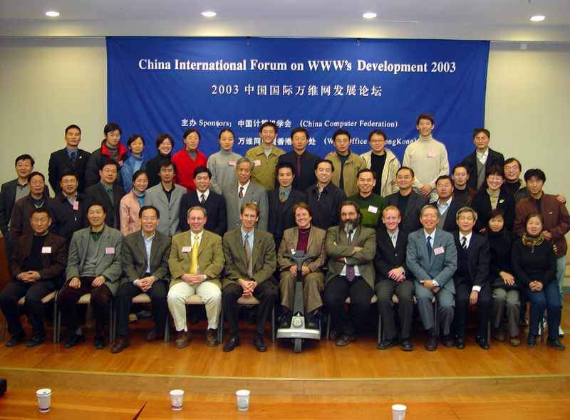

国际 Web 标准参与历程思考

知乎 贺师俊
微博 @johnhax
GitHub @hax

关于我

1998年,
开始写代码
<!-- 早于有「Web前端」 -->

Web前端和JS语言
20多年发展历程
见证人和参与者

- 盛大创新院
- 百姓网
- 360奇舞团

2003 中国国际万维网发展论坛
2013 深圳TPAC
2015 札幌TPAC
2019 福冈TPAC

- HTML5 Chinese IG
- Chinese Web IG

2019年6月~2021年4月
360集团 TC39代表
2021年4月起 特邀专家

JavaScript
编程语言

目前全世界最流行的编程语言
1600万+ 开发者
（Slashdata 2021年Q3统计）

Brendan Eich
1995年的10天
Netscape 2

<!-- 与其他编程语言不同 -->
Web标准
竞争压力
<!-- 浏览器大战 微软 -->

<!-- 尽管并不稳定 -->
互联网脚本语言
事实标准

1996 标准化

Ecma国际
<!-- ECMA => Ecma国际 -->
ECMAScript
ECMA-262
<!-- JavaScript商标 -->
TC39

中国公司和社区？

我个人

2006 开始参与（邮件列表）
2016 日常参与（GitHub）
2017年中 发现问题
2018年底 游说中国科技公司

阿里、腾讯、美团
慧科、字节、360

思考：为什么企业要参与JS标准？

「开放」标准？
以公司、组织为单位

个人身份参与的问题

专业度、代表性
零散、分歧、被动

只能 提供反馈
无法 主导设计

组织技术战略
个人专业能力
<!-- 结合 -->

2019年6月 360集团
成为Ecma国际会员
并加入TC39工作组

2019年12月
- 阿里巴巴
- 华为
- SujiTech

2020年6月 腾讯
2021年6月 字节

- GitHub Repo（通过公开仓库工作和讨论）
- 每2个月一次TC39全体大会（闭门会议）
- 采用共识机制（一票否决）
- 其他辅助性会议（孵化会议、champion group会议等）

由中国代表担任champion的提案一览

- Error cause (Stage 4)
- `Array.prototype.findLast`/`findLastIndex` (Stage 4)

- `function.sent` meta property (Stage 2)
- Double-ended iterators (Stage 1)
- Class branding checks (Stage 1)
- Extensions and `::` operator (Stage 1)
- Slice notation (Stage 1)
- Index from end syntax (Stage 0)

- Limited ArrayBuffer (Stage 1)
- Number Range (Stage 1)
- await operations (Stage 1)
- Legacy reflection features for functions (Stage 1)
- Pattern match (Stage 1)
- Enum and ADT (stage 1)

- `Array.prototype.unique()` (Stage 1)
- Async context (Stage 0)
- String trim characters (Stage 0)

成果很多
挑战更多

真正参与者
仍然很少

- 我（hax），Invited Expert
- Jack Works，SujiTech
- 吴成忠（吞吞），阿里巴巴
- 王文璐，（前）微软中国

- SujiTech：深度参与（个人）
- 阿里巴巴：持续参与（组织）
- 华为、腾讯：基本无参与
- 字节跳动：不定期观察（组织）
- 360：2021年4月之后基本无参与
- 我：深度参与（个人）

时区 英语
意愿 能力

怕自己误解
怕讲不清楚
害羞、客气

JS 技术复杂度
历史包袱和兼容性要求
不同平台的需求冲突
不同标准组织的分工
一些特殊限制（如membrane）
委员会机制和流程
公司关系和人际关系

组织支持
时间、绩效
限制了更广泛
工程师的参与

限制了能力发挥

无法阻止和修正
提案的严重问题

- Class fields 多个严重设计失误
- Top-level await 存在较严重的工程风险
- Hashbang `#!` 鸡肋，潜在生态风险
- `#x in o` 鸡肋
- `Indexed.prototype.at()` 鸡肋
- JSON modules、Module assertions 鸡肋
- `??` 优先级 本可避免的问题
- Range提案 Iterator/Iterable 严重分歧

为什么会这样？

JS 技术复杂度
历史包袱和兼容性要求
不同平台的需求冲突
不同标准组织的分工
一些特殊限制（如membrane）
委员会机制和流程
公司关系和人际关系,
引擎厂商之间的矛盾
代表的个人偏好和倾向性

老一代领袖退出
浏览器厂商话语权过大
缺乏开发者代表
部分代表有严重个人偏好
优先满足委员会内部

人
制度

必须是会员
consensus in the room
一票否决
会议优先于书面

TC39的制度在
标准组织中是
比较特殊的

浏览器厂商之
间的互相制衡

- 缺乏国际化和包容性
- 缺乏对社区的尊重

[中国计算机学会TF43 简报](https://johnhax.net/2021/js-cn/slide#72)
[中国计算机学会TF43 录像](https://dl.ccf.org.cn/video/videoDetail.html?_ack=1&id=5578915538241536)
