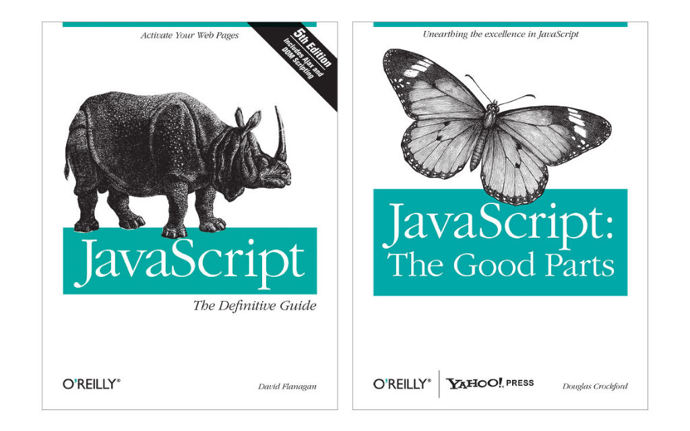

The Bad Parts of JS/TS

知乎 贺师俊
微博 @johnhax
GitHub @hax

关于我

Web前端和JS语言
20多年发展历程
见证人和参与者

编程语言爱好者

对 Groovy 语言并间接对
Swift 等语言有一点点贡献

`..<`
Exclusive Range operator

`1..5`
`1...5`

`1...5`
`1..<5`

做了
一點**微小**的
工作

人吶…
自己就不可以**預料**

Ecma-TC39 JS语言标准委员会
- 2019年6月~2021年4月 360集团 代表
- 2021年4月起 特邀专家

The Bad Parts of JS/TS

2015~2017年期间
做的「鸡血」演讲

JavaScript
The World's Best
Programming Language
___________________________________
《JS — 世界第一程式設計語言》by Hax

- 平台：Browser/Node.js
- 「好爹」：微软、谷歌、苹果……
- 开发者生态和专家委员会
- ES6 的成功

传统 JS（ES3）
其实有很大问题




现代 JS（ES6）
解决了很多问题

- Module 使得 JS 生态系统能重新统一
- Module / Class 等让 JS 更适合大型编程
- Promise 等将最佳实践标准化
- Iterator/Generator/Proxy/Map/Set 等提供了现代语言所需的重要设施
- Arrow function / Destructring 等不仅是语法糖，而且填了长期以来的一些坑

但也许也没有想象的美好


ES3 -> ES5 -> ES6 (ES2015)
自2015年起每年6月发布ES20XX


虽然靴子是 ES2022 才落地
但有问题的几个东西是开发ES6时期已经在讨论的
命运早在五年前（2017年）就已经注定

「改革进入深水区」

- 新语言特性的边际效用下降
- 好做的早做完了，剩下的都是困难的、利弊互现的东西
- 后续还有多个争议性提案

好和坏
客观标准

- 生态位（横向）
- 利益方（纵向）

- 主流语言/利基语言/爱好者语言
- 工业语言/学术语言/教育语言
- 应用编程/系统编程/领域编程

[Priority of Constituencies](https://www.w3.org/TR/html-design-principles/#priority-of-constituencies)
- Users
- Authors
- Implementors
- Specifiers
- Theoretical purity

- 最终用户
- 开发者
- 实现者
- 规范制定者

- 最终用户（兼容性、安全）
- 开发者（心智负担）
- 实现者（复杂度、性能）
- 规范制定者（一致性）

- 应用开发者
- 库和框架开发者
- 生态关键库和框架的维护者
- 工具链实现者
- 运行时实现者
- 引擎实现者

ES2022
[Finished proposals](https://github.com/tc39/proposals/blob/main/finished-proposals.md)

- ES2022 之 class 一坨
- ES2022 之 Top-level `await`
- ES2023 之 Hashbang `#!`
- ES2022 之 `.at()`、`.hasOwn()`、`/pattern/d` 和 `.indices`
- ES2023 之 `Array.prototype.findLast()`/`findLastIndex()`
- ES2022 之 Error cause

1. ES2022 之 class 一坨
0. ES2022 之 Top-level `await`
0. ES2023 之 Hashbang `#!`
0. ES2022 之 `.at()`、`.hasOwn()`、`/pattern/d` 和 `.indices`
0. ES2023 之 `Array.prototype.findLast()`/`findLastIndex()`
0. ES2022 之 Error cause

RegExp Match Indices (ES2022)
`/pattern/d` 和 `.indices`
Ron Buckton，微软

识别问题

```js
let techConfs = `
- GIAC
	date: 2022-11-18
	city: 上海
- IDEA
	date: 2022-11-22
	city: 深圳
`
for (let m of techConfs.matchAll(/date:\s*(.+)/g)) {
	console.log(m)
}
// ['date: 2022-11-18', '2022-11-18', index: 9, ...]
// ['date: 2022-11-22', '2022-11-22', index: 44, ...]
// 无法得到捕获组的索引位置
```

解决方案

```js
for (let m of techConfs.matchAll(/date:\s*(.+)/gd)) {
	console.log(m)
}
// ['date: 2022-11-18', '2022-11-18', index: 9,
// indices: [[9, 25], [15, 25]],
// ...]
// ['date: 2022-11-22', '2022-11-22', index: 44,
// indices: [[44, 60], [50, 60]],
// ...]
```

为什么要额外的`d`？,
因为性能,
`d`的含义？,
inDices

个人评价：有价值
但用例较少，性价比不高
正则本身就有过度复杂和滥用问题

JS正则的 Bad Parts

- 词法复杂性：`/pattern/g` 和除法的歧义
- 语法不方便：`/http:\/\//`
- API 返回混杂数组：`[matched, ...subgroups]&{input, index, groups, indices: [...]&{groups}}`
- global模式：`"hello world!".replace(/[aeiou]/, ch => ch.toUpperCase())`
- global模式：`exec/match/replace`、`replaceAll/matchAll`、`split/splitN`

- 根源：从Perl抄时抄坏了（运算符 -> literal）
- 根治：基于template string的库

`Object.hasOwn()` (ES2022)
Jamie Kyle, Rome (Author)
Tierney Cyren, Microsoft

识别问题

```js
let o = { hasOwnProperty: "hehe" }
o.hasOwnProperty("foo")
Object.create(null).hasOwnProperty("foo")
// Uncaught TypeError: hasOwnProperty is not a function
\
// 健壮但繁琐的写法
let hasOwnProperty = Object.prototype.hasOwnProperty
if (hasOwnProperty.call(o, "foo")) {
  console.log("has property foo")
}
// 或者
if (Object.getOwnPropertyDescriptor(o, "foo")) {
	console.log("has property foo")
}
```

解决方案

```js
if (Object.hasOwn(o, "foo")) {
  console.log("has property foo")
}
```

为什么不是`Object.hasOwnProperty`？,
因为`Object.hasOwnProperty()`已经有了
比如`Object.hasOwnProperty("hasOwn")`得到`true`,
为什么不是`Object.has`？,
因为语义不够清晰，且和`Object.keys`无法完全对应

个人评价：聊胜于无

- 根源：Record和对象的混杂、原型链机制
- 根治：Record类型、Extension机制

`.at()` (ES2022)
Tab Atkins, Shu-yu Guo, Google

识别问题

```js
let last = array[array.length - 1]
```

解决方案

```js
let last = array.at(-1)
```

个人评价：鸡肋

```js
++array[array.length - 1]
array[array.length - 1] = array.at(-1) + 1 // 黑人问号
```


玩笑归玩笑，玩笑背后的真正问题：
`arr.at(i)`方法和`arr[i]`
在处理非索引时语义不同

看似简单，但：

- 字符串是不是有at()方法？
- `arguments`是不是有at()方法？
- `document.body.classList`上是不是有at()方法？

和老的 `String.prototype.at` 提案
语义不同，不能处理代理对字符

`a.at(-idx)` 当`idx`是计算值的时候，
若该值正好为边界值 `0`，到底程序员意图是什么？
- `a.at(a.length - 0)`
- `a.at(0)`

负数索引本身是有坑的
（尽管现有的方法如`slice`已经如此）

```js
let a = [1,2,3]
let i = a.findIndex(x => x > 3)
a[i] // undefined
a.at(i) // 1 !
```

为啥当初不反对这个提案？
因为当初这个提案原名`item()`
有额外的motivation：统一DOM已有的方法
后来因为兼容性问题必须改名就只剩鸡肋

- 根源：负数索引、ToNumber不合理的容错处理
- 根治：`a[^i]`反向索引

Hashbang `#!` (ES2023)
Bradley Farias, Node.js

识别问题

```js
#!/usr/bin/env node
console.log(1);
```

解决方案

```js
#!/usr/bin/env node
console.log(1);
```

个人评价：有潜在风险

```js
#!/usr/bin/env node
if (typeof window === 'object') {
	console.log('browser env')
} else {
	console.log('node env')
}
```
```sh
$ ./test.js          　
```
```html
<script src=test.js>
</script>
```

`hashbang`原本只用于node入口脚本
当进入标准之后可能被滥用于同构脚本

```js
#!/usr/bin/env node
if (isNodeEnv()) {
	openBrowser(htmlFileFor(__filename))
} else {
	// normal code for browser env
	// ...
}
```
```js
#!/usr/bin/env node
if (!isNodeEnv()) initNodeEmulator()
// normal code for node env
// ...
```

```html
<script src=test.js>
</script>
```
```html
<script>
<?php include 'test.js' ?>
</script>
```
,
Oops, syntax error!

```html
<script>#!/usr/bin/env node
console.log('ok')
</script>
```
```html
<!-- Oops, syntax error! -->
<script>
#!/usr/bin/env node
console.log('ok')
</script>
```

无意的空白造成 Syntax Error

[Why only at the start of a Source Text](https://github.com/tc39/proposal-hashbang#why-only-at-the-start-of-a-source-text)
> There is no gain for the intended usage by allowing it in other places and in fact
> could lead to confusion since it would not be picked up by CLI environments.

JS scripts in browsers may be
transformed in various ways

Programmers always have a simple belief:
Prepend/Append whitespaces/comments
will not change the behavior of my code,
(This is true from ES1 to ES2021, until hashbang proposal)

Simple transformations which normally do not use full-featured parser
- Adding copyrights and license at start
- Providing server information for debugging by prepending comments
- Function wrapping (eg. convert CommonJS to AMD/UMD)
- Simple concat of source files
- Not intentionally, but for a variety of reasons adding the newline/whitespace accidently

Stakeholders in production (ordered by timeline)
- Transformers authors (who never expect whitespaces/comments could cause syntax error)
- Operations team
- Script users
- Script authors (who may add hashbang in the future minor verions)

Not immediate problems
But protential risks

Proposed Solution:
Relax hashbang syntax
(make `#!` behave like `//` or `-->`)

Precedents
- BOM (treat BOM as whitespace)
- HTML comments

Alternative Solutions:
Make hashbang support optional (Let browsers do not support it)
So developers will keep only using hashbang in cli-only scripts

- 个人评价：有潜在风险
- 个人建议：通过lint工具禁用

- 根源：CLI特殊需求
- 根治：CLI自行处理（如node/deno等的入口脚本用不同的文件后缀名）

Top-level `await` (ES2022)
Myles Borins, Google
Yulia Startsev, Mozilla
Daniel Ehrenberg, Guy Bedford, Ms2ger, and others.

识别问题

```js
// awaiting.mjs
import { process } from "./some-module.mjs";
let output;
(async () => {
  const dynamic = await import(computedModuleSpecifier);
  const data = await fetch(url);
  output = process(dynamic.default, data);
})();
export { output };
// usage.mjs
import { output } from "./awaiting.mjs";
export function outputPlusValue(value) { return output + value; }
console.log(outputPlusValue(100));
setTimeout(() => console.log(outputPlusValue(100), 1000);
```

解决方案

```js
// awaiting.mjs
import { process } from "./some-module.mjs";
const dynamic = import(computedModuleSpecifier);
const data = fetch(url);
export const output = process((await dynamic).default, await data);
// usage.mjs
import { output } from "./awaiting.mjs";
export function outputPlusValue(value) { return output + value }
console.log(outputPlusValue(100));
```

个人评价：对Node项目还好，对Web项目有大坑

```html
<!doctype html>
<head>
<script type=module>
addEventListener('load', () => {
  doSth()
})
// ...
import 'foo'
</script>
```

```html
<!doctype html>
<head>
<script type=module>
localStorage.data = {x: 42}
// ...
import 'foo'
</script>
<script type=module>
doSth(JSON.parse(localStorage.data))
</script>
```

Top-level `await`
为什么有坑？

- TLA隐式传递，所有依赖TLA的模块都变成异步模块
- TLA确实好用，但可见性很差，以至于很容易无意间引入TLA
- 任何深层依赖的TLA都可以阻塞整个应用
- 无意间引入的TLA可以改变代码的执行序
- 原本合理的重构（无论手动还是自动）可能由于TLA而违反预期

解决方案？

- 教育
- 工具

- 我能教育多少人？
- 教了你你就能避免踩坑吗？
- 教了你你就能避免别人挖坑吗？
- 心智负担：怎么判断这里用TLA是否合理

- 不用TLA检查工具的程序员不是好运维
- 适用所有场景吗？
- 心智负担和背锅负担：怎么判断是否允许TLA
- 心智负担和背锅负担：怎么判断TLA是否会引发问题

从入门到被坑

还没完

Service worker 的故事

- 禁用TLA，除非用动态import导入
- Reasonable（性能！）
- 开创了『那里能用，这里不能用』的先河

可能的解决方案
将Service worker的方案推而广之

- 普通modulescript不允许TLA（但可用动态import）
- async的modulescript允许TLA

```html
<script type=module async></script>
```

- 教育
- 工具

教育：await只能用于async上下文
async functions、async generators、
async module、async script（未来？）
工具：不需要额外工具，直接浏览器里一跑便知

问题

- champions 不同意（理由不明）
- 不是 TC39 的范畴，而是 WHATWG/W3C 的领地

- 个人评价：对Web项目是大坑
- 个人建议：库代码中严格禁用，应用代码中暂时禁用（但目前没有办法禁用~）
- 替代方案：未来lint和打包工具确保只有`<script type=module async>`可以使用

- 根源：Web历史与CLI工具的利益分歧、浏览器厂商对工程风险的忽视
- 根治：无，只能靠工具补救，但性价比极低

Class fields等
- public instance fields
- private instance fields
- private instance methods and accessors
- static ...
- ergonomic brand checks for private elements
- class static block（除外）

```js
class A {
	x = "x"
}
class B extends A {
	get x() { return super.x.toUpperCase() }
}
```

```js
class A {
	x = 1
	test() { return this.x }
}
class B {
	#x = 1
	test() { return this.#x }
}
new Proxy(new A, {}).test() // 1
new Proxy(new B, {}).test() // throw TypeError
```

```js
class A {
	static #x = 1
	static test() { return this.#x }
}
class B extends A {}
B.test() // throw TypeError
```

```js
class A {
	#x
	#y
	equals(that) {
		return #x in that && #y in that
			&& this.#x === that.#x && this.#y === that.#y
	}
}
```

- 个人评价：Considered harmful
- 个人建议：自求多福
- 替代方案：没有（TS在部分问题上有一些保护，但效果有限）

- 根源：非常复杂
- 根治：无，只能靠工具补救，希望未来提案（如静态分派提案和`class.hasInstance`提案）能有所补救

总结

1. ES2022 之 class 一坨：很糟糕，工程上无法控制风险
0. ES2022 之 Top-level `await`：Web项目有较严重的工程风险
0. ES2023 之 Hashbang `#!`：潜在生态风险
0. ES2022 之 `.at()`、`.hasOwn()`、`/pattern/d` 和 `.indices`：鸡肋、聊胜于无、还行

为什么会这样？

JS 技术复杂度
历史包袱和兼容性要求
不同平台的需求冲突
不同标准组织的分工
一些特殊限制（如membrane）
委员会机制和流程
公司关系和人际关系
引擎厂商之间的矛盾
代表的个人偏好和倾向性

老一代领袖退出
浏览器厂商话语权过大
缺乏开发者代表
部分代表有严重个人偏好
优先满足委员会内部

JS语言进入了发展瓶颈期
且未来路径的不确定性风险很高

TypeScript?

JS背着历史包袱，TS背着JS

成也萧何
败也萧何

以更强的静态类型系统
适应动态类型编程惯例

- unsound
- 类型描述非常复杂
- 边际效用下降

JS/TS 的一些核心负资产

- 弱类型
- 错误处理（`catch (e)`子句捕捉所有错误）
- `undefined`和`null`
- mutable prototype（monkey patch）
- UTF16 string

其他一些小问题

- 没有整数类型（很容易去优化）
- ASI（分号）hazards
- 多余的包装类（Java遗产）
- String是iterable
- 迭代器本身也实现了可迭代协议
- indirect eval应该是operator
- switch不好用（C遗产）
- for..in不好用（TCL遗产）
- 糟糕的日期时间类型（Java遗产）
- splice、substr等不好用的API（Perl遗产）

- 无论 JS 语言有多大的问题，JS 的生态会一直发展壮大
- 足够大的生态会孕育工具和方案来逐渐解决问题
- 目前解决 Bad Parts 的主要方式是 TS + Linter
- 但有些问题难以解决，或理论上可解但性价比太低
- 可能是时候考虑在现有 JS/TS 生态中孕育新的语言了

QA

Thank you
