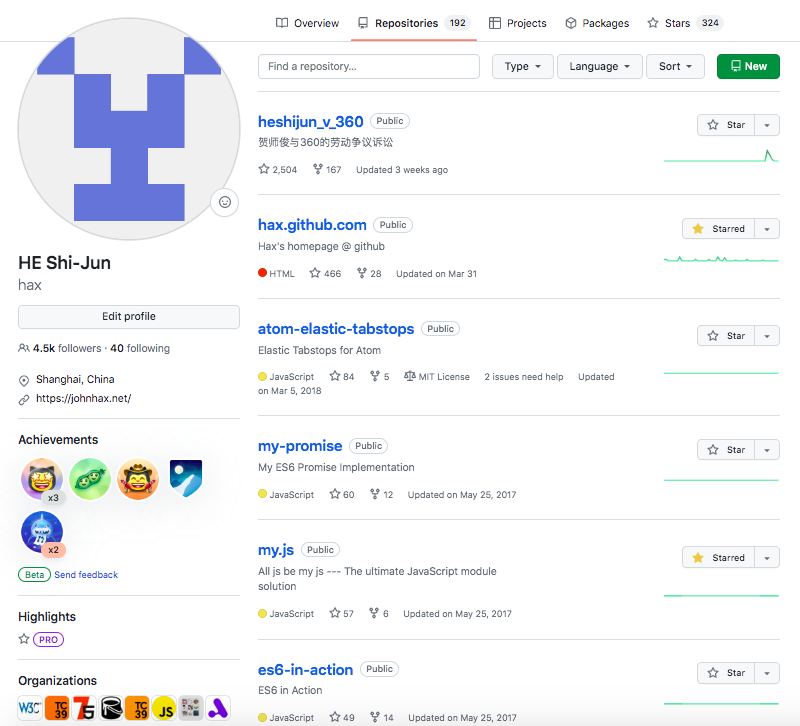

如何更丝滑地在应用中调用 GPT
------------------------------------------------------------
FEDAY 贺师俊 2023年11月18日

说明：今天讲的内容只是一些经验分享
由于AI领域发展太迅猛，可能随时过时
（事实上由于 OpenAI 在 11月6日的大更新，
一开始准备的内容很多不再适用，删改了很多）
请大家不用太认真，随便听听就好 ^_^

关于我

~~35岁~~ **45岁** 程序员

知乎 贺师俊
微博 @johnhax
GitHub @hax



OpenAtom 开放原子开源基金会
首届TOC成员 担任多个开源项目导师

Ecma-TC39
JavaScript 语言标准委员会
- 2019年6月~2021年4月 360集团 代表
- 2021年4月起 特邀专家

JSCIG
JavaScript Chinese Interest Group
发起人和会议组织者

以下JS语言提案的champion
- Generator `function.sent` meta property
- Static Dispatch (Extension methods)
- `class.hasInstance()` meta method
- Double-ended destructuring and iteration
- slice notation (`array[start:end]`)
- index from end (`array[^i]`)

今天不讲 JS
蹭个热点：GPT

[babel.cloud](https://babel.cloud/)

2023
AI 元年

LLM
大语言模型

目前最先进的 LLM
GPT 4,
GPT 4 Turbo

LLM 三大问题
- 答非所问（Unpredictable）
- 胡说八道（Hallucination）
- 视而不见（Context window）

然而短短一年不到
GPT 4 Turbo 已经很大程度解决
- 极好的遵循指令能力、JSON mode、seed
- 知识库更新、大模型调用 Tools
- 8K -> 128K

LLM 非常像 人

儿童 -> 成年人

如何更丝滑地在应用中调用 GPT

为什么要调用 GPT？,
未来的形态？
超级AGI + 小终端？

确实无法预测
不过应用内通过 API 调用 LLM 能力
这种传统形态应该会延续比较长的时期

如何更丝滑地在应用中调用 GPT

合法合规

程序员也要
注意自我保护

科学上网
海外服务器
第三方服务

如果你用 Node.js 直接访问 HTTP 接口
可能会遇到的一个具体的技术问题：
Node.js 下的原生 fetch 如何设置 proxy？,
[请参考我在 stackoverflow 写的相关答案](https://stackoverflow.com/a/77134088/2546547)

流
Stream

为什么要用流？,
思考需要时间,
讲话是流式的

LLM 是逐字输出的
耗时与字数成正比

流式输出对最终用户更友好,
能更早介入，中止无用输出

[Web stream 标准](https://streams.spec.whatwg.org/)

如果你用 Node.js 可能会
遇到的具体的技术问题：

Node.js 支持 Web stream 标准 API 吗？,
其实是支持的，内置包是 `node:stream/web`

但是 IDE 报错找不到 `globalThis.ReadableStream` 等 API？
其实是有的，但是 `@types/node` 类型库还没有加上这些 API
[可以等待 @types/node 更新，或自己给 @types/node 打补丁](https://github.com/DefinitelyTyped/DefinitelyTyped/discussions/66675#discussioncomment-7574171)

node.js 的 stream 和 Web 标准 stream 如何转换？,
`node.js` 已经内置，不要自己写（破）轮子
`Readable`/`Writeable`/`Duplex` `.` `toWeb`/`fromWeb`

GPT API 的具体使用问题：
HTTP 接口返回的是一个 Event Stream
openai官方库返回的是对象的 delta 流

```ts
  const stream = await openai.chat.completions.create({
    model: 'gpt-4',
    messages: [{ role: 'user', content: 'Say this is a test' }],
    stream: true,
  });
  for await (const chunk of stream) {
    process.stdout.write(chunk.choices[0]?.delta?.content ?? '');
  }
```

流的处理还是有点复杂的，还牵涉到很多生态问题：
- node stream 还是 Web 标准 stream
- stream 标准的实现进度（比如 Node.js 尚未实现 `ReadableStream.from()` 方法）
- 类型库问题（TS 默认带的 DOM 类型即 `@types/web` 和 `@types/node` 的定义可能冲突）

Tools

什么是 Tools？,
LLM 使用工具

```ts
  const messages = [{"role": "user", "content": "What's the weather like in Boston today?"}];
  const tools = [
      {
        "type": "function",
        "function": {
          "name": "get_current_weather",
          "description": "Get the current weather in a given location",
          "parameters": {
            "type": "object",
            "properties": {
              "location": {
                "type": "string",
                "description": "The city and state, e.g. San Francisco, CA",
              },
              "unit": {"type": "string", "enum": ["celsius", "fahrenheit"]},
            },
            "required": ["location"],
          },
        }
      }
  ];
  const response = await openai.chat.completions.create({ model: "gpt-3.5-turbo", messages, tools });
```

```json
{
  "choices": [
    {
      "index": 0,
      "message": {
        "role": "assistant",
        "content": null,
        "tool_calls": [
          {
            "id": "call_abc123",
            "type": "function",
            "function": {
              "name": "get_current_weather",
              "arguments": "{\n\"location\": \"Boston, MA\"\n}"
            }
          }
        ]
      },
      "finish_reason": "tool_calls",
    }
  ],
}
```

- 生成函数描述（JSON schema）
- 解析函数调用请求（可能需要校验请求）
- 调用函数
- 会话管理（可能多轮函数调用）

JSON schema
TS 类型描述
几乎是重复的
（但互相也有差异）

[官方示例（使用 zod）](https://github.com/openai/openai-node/blob/master/helpers.md#integrate-with-zod),
先（用 DSL）写 schema
然后自动生成 TS 类型

反向思路：从一个既有函数的
TS 类型和代码注释（JSDoc）
自动生成 JSON schema

一些挑战：

- 复杂 TS 类型的转换
- 识别不可序列化的 TS 类型
- 有些类型理论上是可以序列化的，但需要细致处理
- 在类型之外还需要处理注释
- 工具链限制：原理上必须用 tsc 而不是 esbuild/swc

Agent DSL
- Guidance
- LMQL
- AI.JSX

```ts
import * as AI from 'ai-jsx';
import { Inline } from 'ai-jsx/core/inline';
import { ChatCompletion, UserMessage } from 'ai-jsx/core/completion';
const app = (
  <Inline>
    <ChatCompletion>
      <UserMessage>Come up with the name of a mythical forest animal.</UserMessage>
    </ChatCompletion>
    {'\n\n'}
    {(conversation) => (
      <ChatCompletion>
        <UserMessage>Imagine a mythical forest animal called a "{conversation}". Tell me more about it.</UserMessage>
      </ChatCompletion>
    )}
    {'\n\n'}
    {(conversation) => (
      <ChatCompletion>
        <UserMessage>Now write a poem about this animal: {conversation}</UserMessage>
      </ChatCompletion>
    )}
  </Inline>
);
```

一些考虑：

<ul>
<li>OpenAI 官方库确实过于 low-level，需要高层抽象</li>
<li>但引入一种 DSL 的收益是否足够高？<br>尤其需要考虑应用所使用的编程语言的融合度</li>
<li>新的 Assistant API 可能改变了未来的模式<br>（数据存储和最通用的处理如会话、向量化查询、<br>信息压缩等转移到了OpenAI）</li>
</ul>

如何更丝滑地在应用中调用 GPT
- 更丝滑地访问
- 更丝滑地用流
- 更丝滑地提供Tools
- 更丝滑地写Agent

QA

