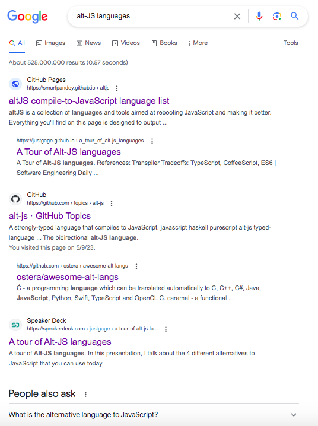

JavaScript/TypeScript 生态下的变种语言评述和展望
------------------------------------------------------------
欧拉多咖研讨会（Web 生态新发展） 贺师俊 2023年7月29日

知乎 贺师俊
微博 @johnhax
GitHub @hax

关于我

Web前端和JS语言
20多年发展历程
见证人和参与者

Ecma-TC39
JavaScript 语言标准委员会
- 2019年6月~2021年4月 360集团 代表
- 2021年4月起 特邀专家

JSCIG
JavaScript Chinese Interest Group
发起人和会议组织者

以下JS语言提案的champion
- Static Dispatch (Extension methods)
- slice notation (`array[start:end]`)
- index from end (`array[^i]`)
- `class.hasInstance()` meta method
- Double-ended destructuring and iteration
- Generator `function.sent` meta property

从 alt-JS 到 var-TS
—— JavaScript/TypeScript 生态下的变种语言评述和展望

什么是 alt-JS？

alt-JS是指可以被编译到JavaScript语言的任何非JavaScript语言。
常见的alt-JS包括TypeScript，CoffeeScript，Dart等。这些语言都
提供了更加丰富的语法和特性，使得开发者可以更加高效地编写复杂
的应用程序。通过编译器或转换工具，alt-JS可以被转换为JavaScript
代码，从而在任何支持JavaScript的浏览器或运行环境上执行。（GPT）

Alternatives to JavaScript

[altjs.org](https://smurfpandey.github.io/altjs/)

百花齐放

咖啡真香

2012

三强争霸

- [CoffeeScript 2009](https://coffeescript.org/)
- [Dart 2011](https://blog.chromium.org/2011/10/dart-language-for-structured.html)
- [TypeScript 2012](http://web.archive.org/web/20210926155037/https://channel9.msdn.com/posts/Anders-Hejlsberg-Introducing-TypeScript)

[2015年时我的看法](https://zhuanlan.zhihu.com/p/20001713)
CoffeeScript、Dart、TypeScript
代表了Web编程语言发展的三条路线

- Coffee：换汤不换药（改语法，基本不改语义）
- TypeScript：保留原汤多加味药（基本不改，加入静态类型）
- Dart：倒掉原来汤药，重新煎一罐（追求性能）

顺便回答
Why alt-JS？

- DX（编程体验）
- PITL（大型编程）
- 性能

[2015年时我的看法](https://zhuanlan.zhihu.com/p/20001713)
- 天下仍然是JavaScript的，但JS本身大变样（ES 6）
- TypeScript全面兼容ES6，路线之争大赢家（尽管用的人还不多）
- CoffeeScript的大量语法糖被吸纳进了ES6里，算保留了精髓
- 只有Dart处于越来越尴尬的境地

[justgage/a-tour-of-alt-js-languages](https://speakerdeck.com/justgage/a-tour-of-alt-js-languages)

- Babel
- TypeScript
- Elm
- ReasonML

CoffeeScript
已经不见了

- [2012/9 Dropbox 宣布其前端代码从JS改为Coffee](https://dropbox.tech/application/dropbox-dives-into-coffeescript)
- [2017/5 Dropbox 基本完成从Coffee到TS的迁移](https://dropbox.tech/frontend/the-great-coffeescript-to-typescript-migration-of-2017)

标志性事件
Atom
sunset on 2022/12

总结一下 alt-JS 的历史
- 前2009：百花齐放
- 2009：咖啡真香
- 2015：三强争霸，TS成为路线赢家
- 2017：Coffee退潮，Dart转型，TS成为主流
- 2022：TS寻求融入JS标准，Coffee离场
- 2015~2022：几乎没有值得一提的新 alt-JS

alt-JS 终结于 TS

为什么 TS 笑到了最后？

- DX（编程体验）
- PITL（大型编程）
- 性能

DX 主观评分
- ES3/ES5 40
- Coffee 85
- ES6 60
- ES6+工具链（TS） 80
- Coffee+工具链 90

性能 可能不是问题
- 90% 的项目不用考虑性能
- JS 性能已经很好
- 性能的工程解决方案有很多（如 WASM）

采用 alt-JS 的收益
采用 alt-JS 的成本

TS/JS 一体化
（无需 alt）

TS 就是答案吗？

没有银弹

- [Deno will stop using TypeScript](https://news.ycombinator.com/item?id=23592483)
- [TypeScript is ‘not worth it’ for developing libraries](https://devclass.com/2023/05/11/typescript-is-not-worth-it-for-developing-libraries-says-svelte-author-as-team-switches-to-javascript-and-jsdoc/)
- [7 really good reasons not to use TypeScript](https://juejin.cn/post/6844904069224480782)
- [17 Compelling Reasons To Start Ditching TypeScript Now](https://dev.to/wiseai/17-compelling-reasons-to-start-ditching-typescript-now-249b)

并不是JS
子集而不是超集
不同的编译选项可认为是不同的子集

类型系统过于强大但又有限制
类型体操
类型代码比实际代码还多
学习曲线、使用成本

By design
Not Sound

仅仅是type checker
无RTTI
类型信息不能
用来提升性能

var-TS

什么是 var-TS？

不用搜索
不用问 ChatGPT

因为这个术语
是我发明的 😎

Variants of TypeScript
基于TypeScript的变种语言
设计目标通常是克服TS的前述问题

- TypeScript++/TypeScript--
- AssemblyScript
- Static TypeScript (Microsoft Makecode)
- UniApp UTS（UCloud）
- OpenHarmony eTS/arkTS（华为）
- AliOS XTS（斑马智行）
- TS2WASM（Intel & 小米）

[Typescript as fast as Rust: Typescript++](https://zaplib.com/docs/blog_ts++.html)
TL;DR: This is a proposal to create a language that sits
somewhere between Typescript and Rust, and which you
can incrementally adopt if you already use Typescript.

Zaplib的创业所基于的出发点
1. JS & the browser are slow
0. Incrementally porting JS to Rust/Wasm will speed up your app
0. We’ll land-and-expand from small ports to take over your whole app
0. In the long-run this evolves to a next-gen stack (”Unity for apps”)

- 目标：性能
- 设想 TS++ 生成更高效的 JS 对象（如利用 ArrayBuffer）
- 设想 TS-- 在文件或函数级别使用类 Rust 的内存模型
- 设想 可以编译到 native 或 wasm

[AssemblyScript](https://www.assemblyscript.org/)
[Doc: Using the langauge](https://www.assemblyscript.org/concepts.html)

- 用 TS 语法写 wasm
- 有对应 JS 的标准库
- 对应 wasm（而不是 JS）的类型系统，没有类型体操
- 有静态类型检查（函数语法），无运行时reflection
- 特性（如 exceptions、async等）受限于 wasm 标准的进度（除了GC）

[我的评价](https://www.zhihu.com/question/347763134/answer/839887835)
写于2019年但今天仍然适用

- 确定性子集（但具有更多基本数据类型）
- 无类型体操相关问题（无union type）
- Sound
- AOT，静态类型用于提升性能
- 需要深入了解 wasm

Static TypeScript
- [MakeCode项目语言介绍](https://makecode.com/language)
- [microsoft/pxt](https://github.com/microsoft/pxt/blob/master/common-docs/javascript/sts.md)
- [Microsoft Research paper](https://www.microsoft.com/en-us/research/publication/static-typescript/)

- 基于 TS 2.6 的子集
- 使用名义类型（nominal type），并支持用虚拟函数表的经典技术对类进行高效编译
- STS 编译为 ARM Thumb 机器码并在浏览器中将其与预编译好的 C++ 运行时链接
- 在小型基准测试中性能可以和 V8 JIT 编译器媲美，所需的内存则低几个数量级
- 可以在 RAM 低达 16kB 的设备（例如 BBC micro:bit）上运行

[UniApp UTS（DCloud）](https://zh.uniapp.dcloud.io/tutorial/syntax-uts.html)
- 目标：跨平台开发，可编译为TS、Kotlin和Swift
- 已经可用，主要用于开发跨平台组件，可利用UniApp已有的跨平台库

我认为UTS的主要挑战
语言的差异

- 细节语义（如基本整数运算的溢出行为）
- 内存模型（Swift使用引用计数和语言级弱引用支持）
- 异步模型（Kotlin、Swift使用结构化异步）
- 异常模型（JS/TS的欠缺）

[Harmony ArkTS/eTS](https://developer.harmonyos.com/cn/docs/documentation/doc-guides/ets-get-started-0000001412054073)

- 在 TS 上增加类似 SwiftUI 的声明式 UI
- 增加更多语言特性（类 Kotlin）
- 方舟编译器优化
- 子集可能考虑中

[AliOS XTS](https://developers.alios.cn/v1/doc/6/7705?refer=aside)

- 目标：性能
- TS 3.3 的子集，不支持 ES module
- 魔改V8引擎（类似于基于V8的AOT）
- unsound/sound 模式（类似 "use strict"）
- 据说 sound 模式在生产中没有人用

 TS2WASM（Intel & 小米）

- 目标：性能
- 方案A：魔改 QuickJS 利用类型信息生成更高效的数据结构（小米手表）
- 方案B：TS子集编译到 WASM（与Intel合作，研发中）
- 详见 XDC2023 前端未来专场《快应用框架在 IoT 场景中的落地》

回顾 Typescript as fast as Rust: Typescript++
[Zaplib post-mortem](https://zaplib.com/docs/blog_post_mortem.html)

“只有真正依赖 Rust 的零成本抽象特性时，才能实现 10 倍的巨大收益——这要归功
于内存布局和对垃圾回收（GC）的规避，因此处理 100 万个 Rust 微结构的速度确
实比处理 100 万个 JS 对象更快。但这种情况其实相当罕见，在增量调整中就更别
指望了。即使 10 倍性能改进基本不成立，工程师们自然不会愿意接受这样一套需要
重新学习、重新维护的工具链和技术堆栈。我们自己肯定不愿意，自然也不能强迫
其他人。总之，**要想实现性能改进，一般都有比转向 Rust/Wasm 更简单的方法**。”

总结

- TS 获得巨大成功，但也孕育着新的机会
- var-TS 雨后春笋，尤其国内公司也有很多不同路线的尝试
- var-TS 的设计目标如果仅是性能，是否能获得市场成功？
- [如何设计一个var-TS？](https://www.zhihu.com/question/442622908/answer/1715676739)

我的探索

- JS/TS的严格子集（语法、语义、标准库）
- 解决一些历史问题（DX、PITL、安全等）
- 改变语义但仍是严格子集（例子：Error机制、const/let/var/using）
- 在子集上扩展（风险评估）

- Static Dispatch (Extension methods)
- slice notation (`array[start:end]`)
- index from end (`array[^i]`)
- `class.hasInstance()` meta method
- Double-ended destructuring and iteration
- Generator `function.sent` meta property

The End

One more thing

AIGC

对于新编程语言是
利空还是利好？

现有编程语言
具有巨大先发优势

编程语言迁移成本
可能大幅降低

更适合普通人的编程语言
也许也是更适合LLM的？

LLM三大问题
- 答非所问（Unpredictable）
- 胡说八道（Hallucination）
- 视而不见（Context window）

人类觉得困难的工作
对于LLM同样困难
—— 微软Semantic Kernel团队

更适合普通人的编程语言
也许也是更适合LLM的？
（例：TypeChat的TS子集）

Discussion
