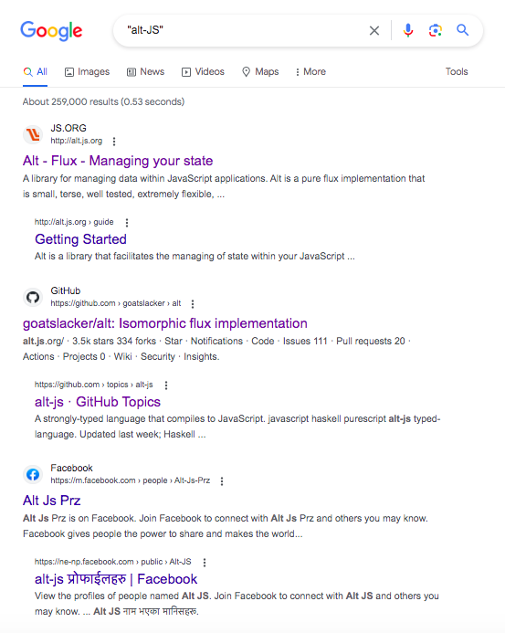

从 alt-JS 到 var-TS
—— JavaScript/TypeScript 生态下的变种语言评述和展望

知乎 贺师俊
微博 @johnhax
GitHub @hax

关于我

Web前端和JS语言
20多年发展历程
见证人和参与者

编程语言
爱好者

对 Groovy 语言并间接对
Swift 等语言有一点点贡献

`..<`
Exclusive Range operator

`1..5`
`1...5`

`1...5`
`1..<5`

做了
一點**微小**的
工作

人吶…
自己就不可以**預料**

Ecma-TC39
JavaScript 语言标准委员会
- 2019年6月~2021年4月 360集团 代表
- 2021年4月起 特邀专家

JSCIG
JavaScript Chinese Interest Group
发起人和会议组织者

以下JS语言提案的champion
- Generator `function.sent` meta property
- Static Dispatch (Extension methods)
- `class.hasInstance()` meta method
- Double-ended destructuring and iteration
- slice notation (`array[start:end]`)
- index from end (`array[^i]`)

从 alt-JS 到 var-TS
—— JavaScript/TypeScript 生态下的变种语言评述和展望

什么是 alt-JS？

Alternatives to JavaScript

alt-JS是指可以被编译到JavaScript语言的任何非JavaScript语言。
常见的alt-JS包括TypeScript，CoffeeScript，Dart等。这些语言都
提供了更加丰富的语法和特性，使得开发者可以更加高效地编写复杂
的应用程序。通过编译器或转换工具，alt-JS可以被转换为JavaScript
代码，从而在任何支持JavaScript的浏览器或运行环境上执行。（GPT）

[altjs.org](https://smurfpandey.github.io/altjs/)

百花齐放

咖啡真香

2012

三强争霸

- [CoffeeScript 2009](https://coffeescript.org/)
- [Dart 2011](https://blog.chromium.org/2011/10/dart-language-for-structured.html)
- [TypeScript 2012](http://web.archive.org/web/20210926155037/https://channel9.msdn.com/posts/Anders-Hejlsberg-Introducing-TypeScript)

[2015年时我的看法](https://zhuanlan.zhihu.com/p/20001713)
CoffeeScript、Dart、TypeScript
代表了Web编程语言发展的三条路线

- Coffee：换汤不换药（改语法，基本不改语义）
- TypeScript：保留原汤多加味药（基本不改，加入静态类型）
- Dart：倒掉原来汤药，重新煎一罐（追求性能）

顺便回答
Why alt-JS？

- DX（编程体验）
- PITL（大型编程）
- 性能

[2015年时我的看法](https://zhuanlan.zhihu.com/p/20001713)
- 天下仍然是JavaScript的，但JS本身大变样（ES 6）
- TypeScript全面兼容ES6，路线之争大赢家（尽管用的人还不多）
- CoffeeScript的大量语法糖被吸纳进了ES6里，算保留了精髓
- 只有Dart处于越来越尴尬的境地

[justgage/a-tour-of-alt-js-languages](https://speakerdeck.com/justgage/a-tour-of-alt-js-languages)

- Babel
- TypeScript
- Elm
- ReasonML

CoffeeScript
已经不见了

- 2012/9 Dropbox 宣布其前端代码从JS改为Coffee
- 2017/5 Dropbox 基本完成从Coffee到TS的迁移

标志性事件
Atom
sunset on 2022/12

总结一下 alt-JS 的历史
- 前2009：百花齐放
- 2009：咖啡真香
- 2015：三强争霸，TS成为路线赢家
- 2017：Coffee退潮，Dart转型，TS成为主流
- 2022：TS寻求融入JS标准，Coffee离场
- 2015~2022：几乎没有值得一提的新 alt-JS

alt-JS 终结于 TS

为什么 TS 笑到了最后？

- DX（编程体验）
- PITL（大型编程）
- 性能

DX 主观评分
- ES3/ES5 40
- Coffee 85
- ES6 60
- ES6+工具链（TS） 80
- Coffee+工具链 90

性能 可能不是问题
- 90% 的项目不用考虑性能
- JS 性能已经很好
- 性能的工程解决方案有很多（如 WASM）

采用 alt-JS 的收益
采用 alt-JS 的成本

TS/JS 一体化
（无需 alt）

TS 就是答案吗？

没有银弹
